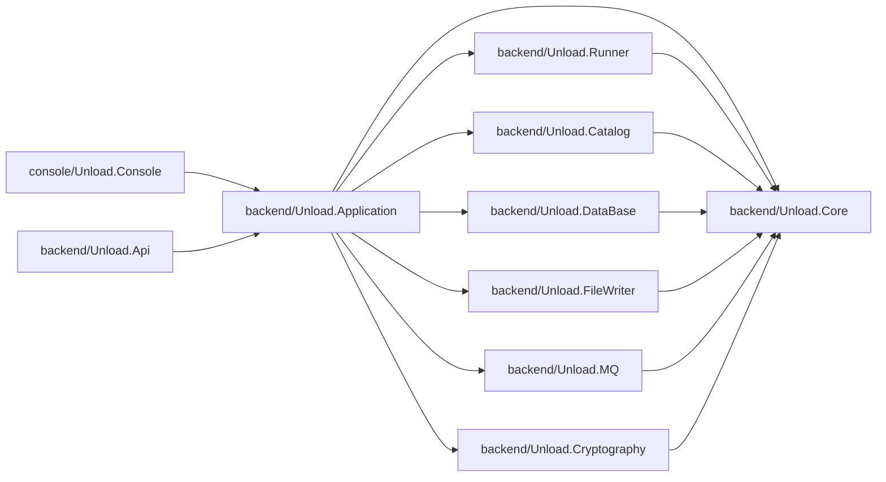
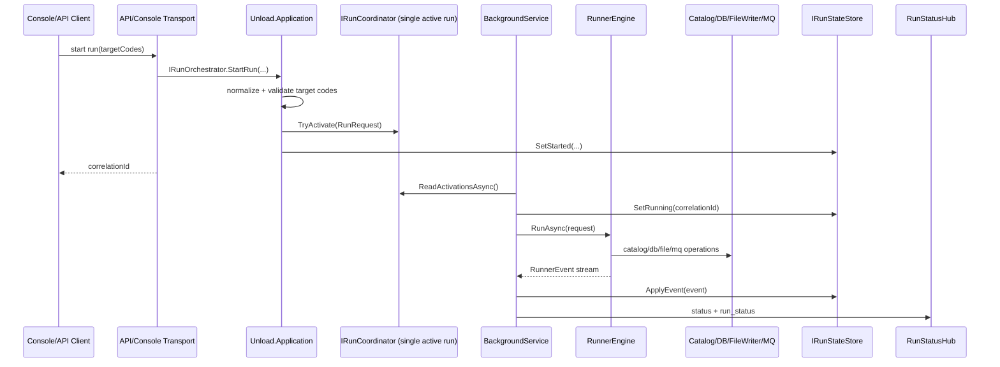

# Unload Architecture

Краткое и прикладное описание проекта для быстрого старта: `README.md`.

## Solution modules

- `backend/Unload.Core`
  - Общие контракты и модели домена.
  - `Domain`: `RunRequest`, `ScriptDefinition`, `DatabaseRow`, `FileChunk`, `WrittenFile`, `RunnerEvent`, `RunnerStep`.
  - `Abstractions`: интерфейсы `IRunner`, `ICatalogService`, `IDatabaseClient`, `IDatabaseClientFactory`, `IFileChunkWriter`, `IMqPublisher`, `IRequestHasher`.

- `backend/Unload.Catalog`
  - Читает `configs/catalog.json`.
  - Опциональная секция `bigScripts`: список `{memberId, groupId}` — target-выборки, чьи скрипты считаются «большими» и выполняются в n-1 потоках.
  - Понимает структуру `groups` + `members` (у `group` есть `folder` и `code`, у `member` есть `groups` и `file`) и строит target-код как `<GROUP_FOLDER>_<MEMBER_CODE>`.
  - Находит SQL-файлы в `scripts/<GROUP_FOLDER>` и отбирает скрипты target-выборки по формату имени `Y<member><group>_<type>_<codes>_<ext>.sql`.
  - Значения `folder`, `code`, `file` используются как есть, без `trim`/приведения регистра.
  - Проверки формата `group.folder`, `member.code`, `targetCode` отключены; защита от выхода за границы директории скриптов сохранена.
  - Для поддержки читаемости разнесено по файлам: `JsonCatalogService` (оркестрация), `CatalogScriptPathHelper` (правила имен и сортировки скриптов).
  - Построение `CatalogInfo` внутри `JsonCatalogService` декомпозировано на небольшие шаги (`BuildMemberGroupCodes`, `BuildTargets`, `BuildGroups`, `BuildMembers`) вместо длинных LINQ-цепочек.

- `backend/Unload.DataBase`
  - Заглушка БД: `StubDatabaseClient`.
  - Фабрика клиентов: `DatabaseClientFactory` (создает независимый клиент на каждый worker).
  - `StubDatabaseClient` поддерживает конструктор `StubDatabaseClient(int timeout, string connectionString)`.
  - `connectionString` может быть:
    - plain-text строкой подключения;
    - строкой формата `dpapi:<base64>`, которая расшифровывается через Windows DPAPI (`CurrentUser`).
  - Контракты БД: `IDatabaseClient` (`IsConnected`, `GetDataReaderAsync(...)`) и `IDatabaseClientFactory` (`CreateClient()`).
  - В раннер передается `DbDataReader`, строки читаются потоково.

- `backend/Unload.FileWriter`
  - Запись чанков в файлы с расширением из имени SQL/`member.file` и разделителем `|`.
  - Параллельность записи регулируется пайплайном (`FileWriterDegreeOfParallelism`); writer не сериализует все чанки глобально.
  - На уровне writer используется пер-файловая блокировка (keyed lock): один и тот же целевой файл пишется строго одним потоком, разные файлы пишутся параллельно.
  - Каждый файл открывается эксклюзивно (`FileMode.CreateNew`, `FileShare.None`), поэтому один конкретный файл всегда пишется только одним потоком.
  - Первая строка файла — служебный заголовок: `#|{type}|{fileName}|2XMDR|{yyyy-MM-dd}|{rowsCount}|{firstCodeDigit}`.
  - Начиная со второй строки пишутся данные из БД через `|`.
  - Пишет в `output/<dd_MM_yyyy_HHmmss>/output-files/`.
  - Формат имени файла: `{first3charsOfScript}{dayOfYear:D3}{chunkNumberBase36}.{ext}` (без `_`).
  - `chunkNumber` ведется сквозной нумерацией по мемберу в рамках запуска (между скриптами одного мембера).

- `backend/Unload.MQ`
  - Заглушка MQ: `InMemoryMqPublisher`.
  - Сохраняет события раннера во внутреннюю очередь.

- `backend/Unload.Cryptography`
  - `Sha256RequestHasher` для формирования run hash.

- `backend/Unload.Runner`
  - `RunnerEngine` + `RunnerOptions`.
  - N worker-потоков (настраиваемо через `WorkerCount`, по умолчанию 4), каждый с одним `IDatabaseClient`.
  - **Большие скрипты** (из `catalog.json` → `bigScripts`): target-выборки (memberId+groupId) выполняются в n-1 потоках; 1 поток всегда для легких скриптов.
  - **BatchReadMode** (опция): при `true` — все данные читаются в память, передаются на запись без ожидания; клиент сразу выполняет следующий запрос. При `false` — потоковое чтение.
- Внутренний `ScriptDistributor` хранит две очереди (`big`, `light`) и выдает следующий скрипт по простому правилу: worker запрашивает задачу с предпочтением (`big-first`/`light-first`), если в предпочтительной очереди пусто — сразу получает скрипт из второй.
  - В событиях `QueryStarted`/`QueryCompleted` указывается `Worker #N`.
  - Один MQ-публикатор: все worker-ы передают события в общий канал.
  - Шаги: resolve target-кодов -> big/light очереди -> worker-ы (запросы БД, чанки, запись, MQ).
  - Значения по умолчанию: `ChunkSizeBytes = 10MB`, `WorkerCount = 4`, `BatchReadMode = false`.
  - В stream-режиме буфер ограничен текущим чанком; в batch-режиме весь результат скрипта в памяти.
  - После каждого шага создается `RunnerEvent`.
  - Формирует CSV-отчет `run-report.csv` с полями: `memberName,fileType,operation,outputFileName,rowsCount,mqStatus,executionTimeMs`.
  - Для скриптов с `0` строк добавляет запись в отчет (`outputFileName` пустой, `rowsCount=0`, `mqStatus=не отправлен`, `executionTimeMs=0`).
  - `operation` маппится из `firstCodeDigit`: `0 -> предоставление`, `2 -> замена`, остальные — число.
  - `mqStatus` фиксирует факт отправки в MQ; при ошибке MQ пайплайн продолжает выполнение.
  - Внутренние детали: `RunnerEngine`, `RunnerEventEmitter` (Channel + Task), `RunnerEngineGuard`, `RunnerOutputDirectoryFactory`, `RunnerEngineDataReader`.

- `backend/Unload.Application`
  - Application-слой use-case запуска выгрузки.
  - Контракты и реализации orchestration: `IRunOrchestrator`, `IRunRequestFactory`, `IRunCoordinator`, `IRunStateStore`.
  - In-memory диспетчер запусков (один активный run без очереди ожидания) и store статусов, общий `RunStatusInfo`.
  - `IRunCoordinator` поддерживает остановку активного запуска (`TryCancel`) и выдает активацию вместе с токеном отмены конкретного run.
  - `RunStatusInfo` хранит статусы мемберов (`MemberStatuses`) отдельно от общего статуса запуска.
  - Общая DI-композиция через `AddUnloadRuntime(UnloadRuntimePaths, DatabaseRuntimeSettings)` для API и Console.
  - Настройки БД валидируются при старте (`TimeoutSeconds > 0`, непустой `ConnectionString`), fallback-значения не используются.

- `backend/Unload.Api`
  - ASP.NET Core API + SignalR.
  - Тонкий транспортный слой: HTTP/SignalR, без бизнес-оркестрации запуска.
  - HTTP-эндпоинты вынесены в MVC-контроллеры: `CatalogController` (`/api/catalog`, `/api/members`) и `RunsController` (`/api/runs*`).
  - Настройки БД читаются из секции `Database` (`TimeoutSeconds`, `ConnectionString`) в `appsettings.Development.json` / `appsettings.Production.json`; секция обязательна.
  - `GET /api/catalog` — отдает структуру каталога (группы, участники, target-выборки), где:
    - `group.name` отдается в формате `{имя (folder)}`;
    - `member.name` отдается в формате `{имя (Y{memberCode}{groupCode}*.ext)}`.
  - `GET /api/members` — отдает список мемберов для запуска (`code`, `name`, `targetCodes`) и, если есть активный запуск, текущий статус мембера (`activeRunCorrelationId`, `activeRunStatus`).
  - `POST /api/runs` — запускает выгрузку для выбранных мемберов (`memberCodes`) и возвращает `correlationId`.
  - Если запуск уже выполняется, `POST /api/runs` возвращает `409 Conflict` с `activeCorrelationId`.
  - `POST /api/runs/{correlationId}/stop` — останавливает активный запуск по `correlationId`.
  - `GET /api/runs` — список запусков и их статусы.
  - `GET /api/runs/active` — текущий активный запуск (если есть).
  - `GET /api/runs/{correlationId}` — статус конкретного запуска.
  - Запуски обрабатываются фоновым worker (`BackgroundService`) без очереди ожидания: одновременно выполняется только один запуск.
  - SignalR Hub: `/hubs/status`, подписка на конкретный запуск через `SubscribeRun(correlationId)`.
  - SignalR события:
    - `status` — события раннера активного запуска для всех подключенных клиентов;
    - `run_status` — обновления статуса запуска и мемберов для всех подключенных клиентов.
  - `Program` оставлен как точка конфигурации DI/маршрутизации (`AddControllers`, `MapControllers`), резолв путей вынесен в `ApiWorkspacePathResolver`.

- `console/Unload.Console`
  - Точка входа.
  - DI через `Microsoft.Extensions.DependencyInjection`.
  - Переиспользует тот же runtime/use-case слой (`Unload.Application`), что и API.
  - Настройки БД читаются из `appsettings.{Environment}.json` (переменные окружения `DOTNET_ENVIRONMENT` / `ASPNETCORE_ENVIRONMENT`, по умолчанию `Production`); секция `Database` обязательна.
  - Запуск инициируется через `IRunOrchestrator` и тот же single-run диспетчер (`IRunCoordinator`), без очереди ожидания.
  - Отображение событий в терминале через `Spectre.Console`.
  - После завершения запуска выводит общее время выгрузки (`Total export time`, формат `hh:mm:ss.fff`).
  - Автоматически определяет корень workspace (ищет `configs/catalog.json` и папку `scripts` вверх по дереву директорий).
- Если target-коды не переданы аргументами, интерактивно показывает target-выборки по группам/участникам через `ICatalogService.GetCatalogAsync()` из `backend/Unload.Catalog`; в мультиселекте все пункты выбраны по умолчанию.
- Во время выполнения показывает live-таблицу по количеству worker-потоков (`Runner.WorkerCount`) с фиксированной шириной колонок и текущим состоянием каждого потока (`running <script>` / `idle`) плюс последнее событие раннера.
  - Код разнесен по сущностям: `Program` (точка входа), `WorkspacePathResolver` (пути runtime), `TargetCodePrompter` (интерактивный выбор на основе `CatalogInfo`).

- `console/Unload.WebConsole`
  - Консольный клиент API (замена frontend для тестов).
  - Интерфейс построен на `Spectre.Console` (панель статуса + live-лента событий).
  - Работает через HTTP (`/api/runs`, `/api/runs/active`, `/api/runs/{id}`) и SignalR (`/hubs/status`).
  - Перед стартом проверяет `GET /api/runs/active`; если уже есть активный run, новый запуск из WebConsole блокируется, клиент переключается в режим наблюдения.
  - Умеет стартовать запуск по `memberCodes`, обрабатывать `409 Conflict` при гонке состояний, останавливать активный запуск и подключаться к live-статусам.
  - Показывает отдельную таблицу статусов мемберов (pending/running/completed/failed/cancelled).
  - В live-режиме показывает индикаторы ожидания (спиннер в статусе и плейсхолдерах таблиц) пока не пришли события/статусы.
  - Live-таблицы ограничены по размеру: показывают только последние события и верхние строки мемберов с обрезкой длинных сообщений, чтобы интерфейс помещался в экран.
  - После завершения run live-рендер очищается и выводится отдельный финальный snapshot (`Run Finished`, `Final Members`, `Final Events`), чтобы исключить визуальную путаницу со «старой» динамической таблицей.
  - Ожидание завершения run в клиенте реализовано через встроенный `PeriodicTimer` (.NET), без ручного цикла `Task.Delay`.
  - Если `--members` не передан, показывает интерактивный multi-select мемберов из `GET /api/members`; пустой выбор включает режим наблюдения за активной выгрузкой.

## Module diagram



## Execution flow

1. Консоль или API вызывает `IRunOrchestrator` из `Unload.Application` для старта запуска.
2. `IRunOrchestrator` валидирует target-коды (полученные из выбранных мемберов), формирует `RunRequest`, резервирует единственный слот выполнения и сохраняет начальный статус.
3. `RunProcessingBackgroundService` в API принимает активированный запуск и запускает `RunnerEngine`.
4. `RunnerEngine` эмитит `RequestAccepted`.
5. `JsonCatalogService` возвращает скрипты для выбранных target-кодов.
6. Big scripts (из `bigScripts`) приоритетно выполняются в n-1 потоках, остальные — в оставшихся потоках; каждый worker в цикле запрашивает следующий скрипт у `ScriptDistributor` (big-first/light-first), при пустой "своей" очереди сразу берет скрипты из другой. Для каждого скрипта:
   - worker получает `DbDataReader` из БД; в stream-режиме читает потоково, в batch-режиме — весь результат в память;
   - worker формирует чанки и либо записывает (stream), либо отправляет в канал записи (batch);
   - при batch-режиме отдельный consumer пишет чанки на диск; worker не ждет записи и сразу выполняет следующий запрос;
   - если скрипт вернул `0` строк, выходной файл не создается.
7. На каждом шаге публикуется событие в MQ-заглушку и обновляется статус запуска/мембера.
8. В конце эмитится `Completed` или `Failed`; при остановке пользователем статус становится `Cancelled`.

## Каталог и bigScripts

В `configs/catalog.json` опциональная секция `bigScripts` задает target-выборки (memberId+groupId), чьи скрипты считаются «большими»:

```json
"bigScripts": [
  { "memberId": 1, "groupId": 1 }
]
```

Скрипты таких target-кодов выполняются в n-1 потоках; 1 поток всегда резервируется для легких скриптов.

## Форматы имен и выходных файлов

### Формат SQL-скрипта

- `Y<memberCode><groupCode>_<type>_<codes>_<extension>.sql`
- `Y` — константный префикс.
- `<memberCode>` — код мембера (2-й символ имени).
- `<groupCode>` — код группы из `catalog.json` (3-й символ имени).
- `<type>` — тип выгрузки, используется в заголовке output-файла.
- `<codes>` — один или несколько числовых кодов, разделенных `_` (например, `01` или `01_2_15`).
- `<extension>` — расширение output-файла без точки (должно совпадать с `member.file` без `.`).

### Формат выходного файла

- Имя: `{first3charsOfScript}{dayOfYear:D3}{chunkNumberBase36}.{extension}`
- `chunkNumberBase36` — сквозной номер чанка для конкретного мембера в рамках запуска, в верхнем регистре base36 (`01`, `02`, ... `09`, `0A`, `0B`, ...).
- При коллизии имени (например, параллельная запись двух файлов с одинаковым шаблоном) автоматически добавляется суффикс `_{NN}`: `{first3charsOfScript}{dayOfYear:D3}{chunkNumberBase36}_{NN}.{extension}`.
- Первая строка:
  - `#|{type}|{outputFileName}|2XMDR|{yyyy-MM-dd}|{rowsCountWithoutHeader}|{firstDigitFromCodes}`
- Остальные строки:
  - данные из БД через `|`.
  - символ `|` не экранируется обратным слешом.

### Структура output и CSV-отчета

- Папка запуска: `output/<dd_MM_yyyy_HHmmss>/`
- Выходные файлы чанков: `output/<dd_MM_yyyy_HHmmss>/output-files/`
- CSV-отчет запуска: `output/<dd_MM_yyyy_HHmmss>/run-report.csv`
- Формат CSV:
  - `memberName,fileType,operation,outputFileName,rowsCount,mqStatus,executionTimeMs`
  - `mqStatus`: `отправлен` / `не отправлен`
  - `executionTimeMs`: время записи конкретного output-файла (чанка) в миллисекундах.
  - Для скриптов без строк: `outputFileName=""`, `rowsCount=0`, `mqStatus=не отправлен`, `executionTimeMs=0`.

## Run sequence diagram



## Code documentation

- Во всех ключевых классах и методах backend/console добавлены XML-комментарии.
- В `backend/Unload.Application` дополнены XML-комментарии для `IRunCoordinator` и `InMemoryRunCoordinator`.
- В `console/Unload.WebConsole` добавлены XML-комментарии для типов `AppOptions`, `RunApiClient`, `RunDashboardBuilder`, `UiState`, `WebConsoleRunner` и DTO/enum-моделей из `Models.cs`.
- `WebConsoleRunner` декомпозирован на небольшие шаги (`ConnectToHubAsync`, `ResolveTrackedRunAsync`, `RenderLiveDashboardAsync`, `RefreshFinalStateAsync`, `RenderFinalSummary`) для упрощения чтения и сопровождения.
- `RunDashboardBuilder` избавлен от дублирования между live/final режимами через общие builder-методы (`BuildLayout`, `BuildInfoPanel`, `BuildMembersTable`, `BuildEventsTable`) и вынесенные мапперы цветов.
- Комментарии описывают:
  - где используется компонент;
  - как работает метод или класс;
  - входные параметры (`param`) и выход (`returns`) для методов.
- Этот формат документации следует поддерживать при добавлении новых публичных и приватных методов core runtime.
- Для run-моделей рекомендуется поддерживать синхронность API-контрактов: если меняется payload (`memberCodes`, `MemberStatuses`, `stop` endpoint), обновлять docs и WebConsole одновременно.

## API run

Запуск API из корня solution:

```powershell
dotnet run --project .\backend\Unload.Api\Unload.Api.csproj
```

Пример запуска выгрузки:

```powershell
curl -X POST http://localhost:5000/api/runs -H "Content-Type: application/json" -d "{\"memberCodes\":[\"M\"]}"
```

Получение списка доступных мемберов:

```powershell
curl http://localhost:5000/api/members
```

Проверка статусов запусков:
Остановка активной выгрузки:

```powershell
curl -X POST http://localhost:5000/api/runs/{correlationId}/stop
```


```powershell
curl http://localhost:5000/api/runs
```

Проверка активного запуска:

```powershell
curl http://localhost:5000/api/runs/active
```

Подписка клиента SignalR:

- Подключиться к `/hubs/status`.
- Вызвать `SubscribeRun(correlationId)` (опционально для обратной совместимости).
- Слушать событие `status` с payload `RunnerEvent` (событие отправляется всем подключенным клиентам).
- Для общей ленты запусков слушать событие `run_status` с payload `RunStatusInfo`.

## Run

Из корня solution:

```powershell
dotnet run --project .\console\Unload.Console\Unload.Console.csproj
```

С указанием target-кодов:

```powershell
dotnet run --project .\console\Unload.Console\Unload.Console.csproj -- QQW,QQE
```

## WebConsole

Запуск web-клиента для API:

```powershell
dotnet run --project .\console\Unload.WebConsole\Unload.WebConsole.csproj -- --api http://localhost:5000 --members M
```

Режим наблюдения за уже активной выгрузкой:

```powershell
dotnet run --project .\console\Unload.WebConsole\Unload.WebConsole.csproj -- --api http://localhost:5000
```
