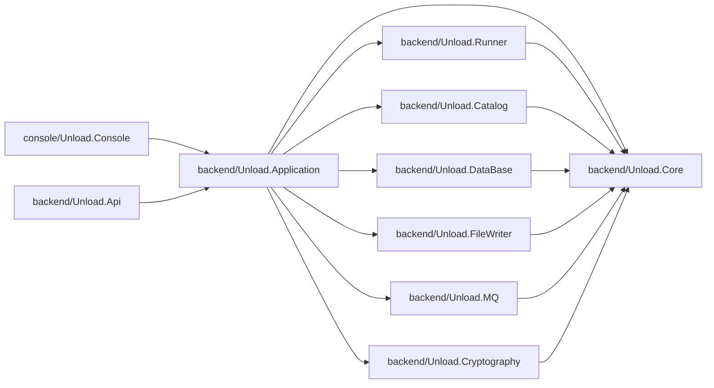
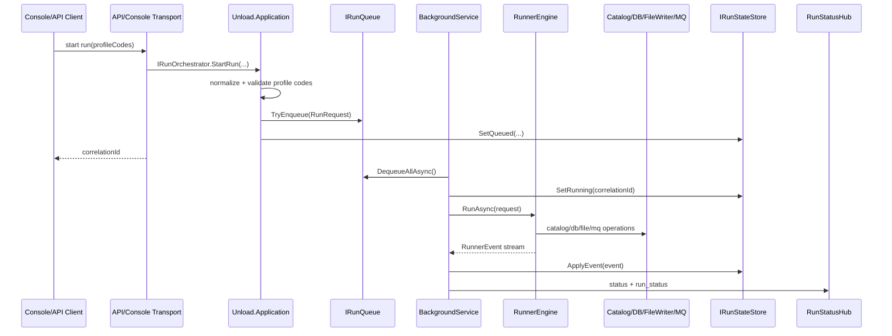

# Unload Architecture

## Solution modules

- `backend/Unload.Core`
  - Общие контракты и модели домена.
  - `Domain`: `RunRequest`, `ScriptDefinition`, `DatabaseRow`, `FileChunk`, `WrittenFile`, `RunnerEvent`, `RunnerStep`.
  - `Abstractions`: интерфейсы `IRunner`, `ICatalogService`, `IDatabaseClient`, `IFileChunkWriter`, `IMqPublisher`, `IRequestHasher`.

- `backend/Unload.Catalog`
  - Читает `configs/catalog.json`.
  - Понимает структуру `groups` + `members` (у `member` есть `groups` и `file`) и строит код профиля как `<GROUP_FOLDER>_<MEMBER_CODE>`.
  - Находит SQL-файлы в `scripts/<GROUP_FOLDER>` и отбирает скрипты профиля по второй букве имени файла (`member.code`).
  - Валидирует `group.folder`, `member.code`, `profileCode` и защищает от выхода за границы директории скриптов.

- `backend/Unload.DataBase`
  - Заглушка БД: `StubDatabaseClient`.
  - Контракт БД: `IDatabaseClient` с `IsConnected` и `GetDataReaderAsync(query, cancellationToken)`.
  - В раннер передается `DbDataReader`, строки читаются потоково.

- `backend/Unload.FileWriter`
  - Запись чанков в файлы с расширением из `member.file` и разделителем `|`.
  - Первая строка файла — заголовок (имена колонок через `|`), далее строки данных.
  - Пишет в `output/<dd_MM_yyyy_HHmmss>/` без подпапок.
  - Формат имени файла: `Y<member.code><3rd letter of group.folder>_<sql name after first 3 chars>_<chunk><member.file>`.
  - `<chunk>` — base36 суффикс чанка (`00`, `01`, ..., `09`, `0A`, ..., `0Z`, `10`, ...).

- `backend/Unload.MQ`
  - Заглушка MQ: `InMemoryMqPublisher`.
  - Сохраняет события раннера во внутреннюю очередь.

- `backend/Unload.Cryptography`
  - `Sha256RequestHasher` для формирования run hash.

- `backend/Unload.Runner`
  - `RunnerEngine` + `RunnerOptions`.
  - Параллельно выполняет скрипты (`MaxDegreeOfParallelism`) и читает `DbDataReader` потоково.
  - Шаги: resolve профилей -> запуск запроса -> on-the-fly разбиение на чанки до 10MB -> запись файлов.
  - Не держит все строки скрипта в памяти: буфер ограничен текущим чанком.
  - После каждого шага создается `RunnerEvent`.
  - Диагностика: пишет полный лог событий и метрики длительности шагов в CSV через `IRunDiagnosticsSink`.

- `backend/Unload.Application`
  - Application-слой use-case запуска выгрузки.
  - Контракты и реализации orchestration: `IRunOrchestrator`, `IRunRequestFactory`, `IRunQueue`, `IRunStateStore`.
  - In-memory реализации очереди и store статусов, общий `RunStatusInfo`.
  - Общая DI-композиция через `AddUnloadRuntime(UnloadRuntimePaths)` для API и Console.

- `backend/Unload.Api`
  - ASP.NET Core API + SignalR.
  - Тонкий транспортный слой: HTTP/SignalR, без бизнес-оркестрации запуска.
  - `GET /api/catalog` — отдает структуру каталога (группы, участники, профили).
  - `POST /api/runs` — ставит запуск в очередь и возвращает `correlationId`.
  - `GET /api/runs` — список запусков и их статусы.
  - `GET /api/runs/{correlationId}` — статус конкретного запуска.
  - Запуски обрабатываются фоновым worker (`BackgroundService`) из общей in-memory очереди.
  - SignalR Hub: `/hubs/status`, подписка на конкретный запуск через `SubscribeRun(correlationId)`.
  - SignalR события:
    - `status` — события раннера конкретного запуска;
    - `run_status` — обновления статуса запуска для всех подключенных клиентов.

- `console/Unload.Console`
  - Точка входа.
  - DI через `Microsoft.Extensions.DependencyInjection`.
  - Переиспользует тот же runtime/use-case слой (`Unload.Application`), что и API.
  - Отображение событий в терминале через `Spectre.Console`.
  - Автоматически определяет корень workspace (ищет `configs/catalog.json` и папку `scripts` вверх по дереву директорий).
  - Если профили не переданы аргументами, интерактивно показывает профили по группам/участникам из `catalog.json` и позволяет выбрать выгрузку через мультиселект.

## Module diagram



## Execution flow

1. Консоль или API вызывает `IRunOrchestrator` из `Unload.Application` для постановки запуска в очередь.
2. `IRunOrchestrator` валидирует профили, формирует `RunRequest` и сохраняет начальный статус.
3. `RunProcessingBackgroundService` в API извлекает задачу из очереди и запускает `RunnerEngine`.
4. `RunnerEngine` эмитит `RequestAccepted`.
5. `JsonCatalogService` возвращает скрипты для выбранных профилей.
6. Для каждого скрипта:
   - получить `DbDataReader` из БД;
   - читать строки потоково;
   - собирать текущий чанк до лимита размера;
   - записывать чанк в файл и продолжать чтение.
7. На каждом шаге публикуется событие в MQ-заглушку, сохраняется диагностика и обновляется статус запуска.
8. В конце эмитится `Completed` или `Failed`.

## Run sequence diagram



## Observability

- Базовая папка диагностики по умолчанию: `observability` в корне workspace.
- Можно переопределить через переменную окружения `UNLOAD_DIAGNOSTICS_DIR`.
- Для каждого запуска (`correlationId`) создается отдельная папка:
  - `events.csv`: полный лог событий (`RunnerEvent`).
  - `metrics.csv`: длительность шагов (`duration_ms`) и итог (`outcome`).
  - Для сравнения длительности скриптов используется строка с `step=ScriptCompleted`:
    - `profile_code` + `script_code` + `duration_ms` показывают полное время выгрузки скрипта (query + запись чанков).
- Формат CSV безопасно экранируется, чтобы избежать CSV formula injection при открытии в табличных редакторах.

## API run

Запуск API из корня solution:

```powershell
dotnet run --project .\backend\Unload.Api\Unload.Api.csproj
```

Пример запуска выгрузки:

```powershell
curl -X POST http://localhost:5000/api/runs -H "Content-Type: application/json" -d "{\"profileCodes\":[\"YSB_M\"]}"
```

Проверка статусов запусков:

```powershell
curl http://localhost:5000/api/runs
```

Подписка клиента SignalR:

- Подключиться к `/hubs/status`.
- Вызвать `SubscribeRun(correlationId)`.
- Слушать событие `status` с payload `RunnerEvent`.
- Для общей ленты запусков слушать событие `run_status` с payload `RunStatusInfo`.

## Run

Из корня solution:

```powershell
dotnet run --project .\console\Unload.Console\Unload.Console.csproj
```

С указанием профилей:

```powershell
dotnet run --project .\console\Unload.Console\Unload.Console.csproj -- QQW,QQE
```
