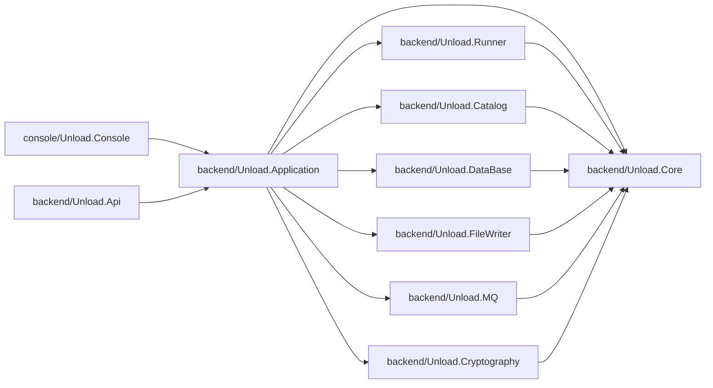
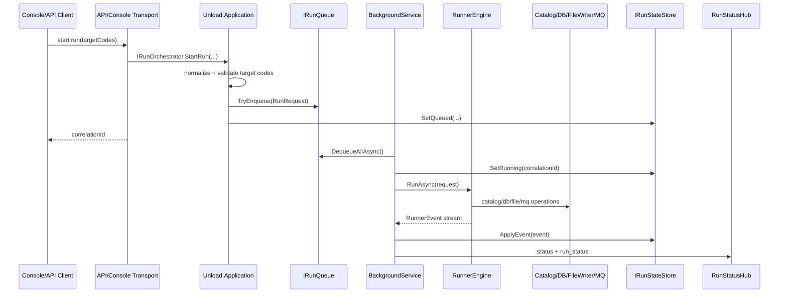

# Unload Architecture

## Solution modules

- `backend/Unload.Core`
  - Общие контракты и модели домена.
  - `Domain`: `RunRequest`, `ScriptDefinition`, `DatabaseRow`, `FileChunk`, `WrittenFile`, `RunnerEvent`, `RunnerStep`.
  - `Abstractions`: интерфейсы `IRunner`, `ICatalogService`, `IDatabaseClient`, `IFileChunkWriter`, `IMqPublisher`, `IRequestHasher`.

- `backend/Unload.Catalog`
  - Читает `configs/catalog.json`.
  - Понимает структуру `groups` + `members` (у `group` есть `folder` и `code`, у `member` есть `groups` и `file`) и строит target-код как `<GROUP_FOLDER>_<MEMBER_CODE>`.
  - Находит SQL-файлы в `scripts/<GROUP_FOLDER>` и отбирает скрипты target-выборки по формату имени `Y<member><group>_<type>_<codes>_<ext>.sql`.
  - Значения `folder`, `code`, `file` используются как есть, без `trim`/приведения регистра.
  - Проверки формата `group.folder`, `member.code`, `targetCode` отключены; защита от выхода за границы директории скриптов сохранена.
  - Для поддержки читаемости разнесено по файлам: `JsonCatalogService` (оркестрация), `CatalogScriptPathHelper` (правила имен и сортировки скриптов).
  - Построение `CatalogInfo` внутри `JsonCatalogService` декомпозировано на небольшие шаги (`BuildMemberGroupCodes`, `BuildTargets`, `BuildGroups`, `BuildMembers`) вместо длинных LINQ-цепочек.

- `backend/Unload.DataBase`
  - Заглушка БД: `StubDatabaseClient`.
  - Контракт БД: `IDatabaseClient` с `IsConnected` и `GetDataReaderAsync(query, cancellationToken)`.
  - В раннер передается `DbDataReader`, строки читаются потоково.

- `backend/Unload.FileWriter`
  - Запись чанков в файлы с расширением из имени SQL/`member.file` и разделителем `|`.
  - Первая строка файла — служебный заголовок: `#|{type}|{fileName}|2XMDR|{yyyy-MM-dd}|{rowsCount}|{firstCodeDigit}`.
  - Начиная со второй строки пишутся данные из БД через `|`.
  - Пишет в `output/<dd_MM_yyyy_HHmmss>/` без подпапок.
  - Формат имени файла: `{first3charsOfScript}{dayOfYear}{chunkNumber}.{ext}` (без `_`).

- `backend/Unload.MQ`
  - Заглушка MQ: `InMemoryMqPublisher`.
  - Сохраняет события раннера во внутреннюю очередь.

- `backend/Unload.Cryptography`
  - `Sha256RequestHasher` для формирования run hash.

- `backend/Unload.Runner`
  - `RunnerEngine` + `RunnerOptions`.
  - Параллельно выполняет скрипты (`MaxDegreeOfParallelism`) и читает `DbDataReader` потоково.
  - Шаги: resolve target-кодов -> запуск запроса -> on-the-fly разбиение на чанки до 10MB -> запись файлов.
  - Не держит все строки скрипта в памяти: буфер ограничен текущим чанком.
  - После каждого шага создается `RunnerEvent`.
  - Внутренние детали разнесены: `RunnerEngine` (пайплайн), `RunnerEngineGuard` (проверки и output-путь), `RunnerEngineDataReader` (чтение колонок/строк из `DbDataReader`).

- `backend/Unload.Application`
  - Application-слой use-case запуска выгрузки.
  - Контракты и реализации orchestration: `IRunOrchestrator`, `IRunRequestFactory`, `IRunQueue`, `IRunStateStore`.
  - In-memory реализации очереди и store статусов, общий `RunStatusInfo`.
  - Общая DI-композиция через `AddUnloadRuntime(UnloadRuntimePaths)` для API и Console.

- `backend/Unload.Api`
  - ASP.NET Core API + SignalR.
  - Тонкий транспортный слой: HTTP/SignalR, без бизнес-оркестрации запуска.
  - `GET /api/catalog` — отдает структуру каталога (группы, участники, target-выборки), где:
    - `group.name` отдается в формате `{имя (folder)}`;
    - `member.name` отдается в формате `{имя (Y{memberCode}{groupCode}*.ext)}`.
  - `POST /api/runs` — ставит запуск в очередь и возвращает `correlationId`.
  - `GET /api/runs` — список запусков и их статусы.
  - `GET /api/runs/{correlationId}` — статус конкретного запуска.
  - Запуски обрабатываются фоновым worker (`BackgroundService`) из общей in-memory очереди.
  - SignalR Hub: `/hubs/status`, подписка на конкретный запуск через `SubscribeRun(correlationId)`.
  - SignalR события:
    - `status` — события раннера конкретного запуска;
    - `run_status` — обновления статуса запуска для всех подключенных клиентов.
  - `Program` оставлен как точка конфигурации endpoint-ов, резолв путей вынесен в `ApiWorkspacePathResolver`.

- `console/Unload.Console`
  - Точка входа.
  - DI через `Microsoft.Extensions.DependencyInjection`.
  - Переиспользует тот же runtime/use-case слой (`Unload.Application`), что и API.
  - Отображение событий в терминале через `Spectre.Console`.
  - Автоматически определяет корень workspace (ищет `configs/catalog.json` и папку `scripts` вверх по дереву директорий).
  - Если target-коды не переданы аргументами, интерактивно показывает target-выборки по группам/участникам из `catalog.json` и позволяет выбрать выгрузку через мультиселект.
  - Код разнесен по сущностям: `Program` (точка входа), `WorkspacePathResolver` (пути runtime), `TargetCodePrompter` (интерактивный выбор), `CatalogSelectionLoader` + `CatalogSelectionJsonModels` (чтение модели каталога).

## Module diagram



## Execution flow

1. Консоль или API вызывает `IRunOrchestrator` из `Unload.Application` для постановки запуска в очередь.
2. `IRunOrchestrator` валидирует target-коды, формирует `RunRequest` и сохраняет начальный статус.
3. `RunProcessingBackgroundService` в API извлекает задачу из очереди и запускает `RunnerEngine`.
4. `RunnerEngine` эмитит `RequestAccepted`.
5. `JsonCatalogService` возвращает скрипты для выбранных target-кодов.
6. Для каждого скрипта:
   - получить `DbDataReader` из БД;
   - читать строки потоково;
   - если скрипт вернул `0` строк, не создавать выходной файл и не публиковать события файла (`ChunkCreated`/`FileWritten`) в MQ;
   - собирать текущий чанк до лимита размера;
   - записывать чанк в файл и продолжать чтение.
7. На каждом шаге публикуется событие в MQ-заглушку и обновляется статус запуска.
8. В конце эмитится `Completed` или `Failed`.

## Форматы имен и выходных файлов

### Формат SQL-скрипта

- `Y<memberCode><groupCode>_<type>_<codes>_<extension>.sql`
- `Y` — константный префикс.
- `<memberCode>` — код мембера (2-й символ имени).
- `<groupCode>` — код группы из `catalog.json` (3-й символ имени).
- `<type>` — тип выгрузки, используется в заголовке output-файла.
- `<codes>` — один или несколько числовых кодов, разделенных `_` (например, `01` или `01_2_15`).
- `<extension>` — расширение output-файла без точки (должно совпадать с `member.file` без `.`).

### Формат выходного файла

- Имя: `{first3charsOfScript}{dayOfYear}{chunkNumber}.{extension}`
- Первая строка:
  - `#|{type}|{outputFileName}|2XMDR|{yyyy-MM-dd}|{rowsCountWithoutHeader}|{firstDigitFromCodes}`
- Остальные строки:
  - данные из БД через `|`.

## Run sequence diagram



## Code documentation

- Во всех ключевых классах и методах backend/console добавлены XML-комментарии.
- Комментарии описывают:
  - где используется компонент;
  - как работает метод или класс;
  - входные параметры (`param`) и выход (`returns`) для методов.
- Этот формат документации следует поддерживать при добавлении новых публичных и приватных методов core runtime.

## API run

Запуск API из корня solution:

```powershell
dotnet run --project .\backend\Unload.Api\Unload.Api.csproj
```

Пример запуска выгрузки:

```powershell
curl -X POST http://localhost:5000/api/runs -H "Content-Type: application/json" -d "{\"targetCodes\":[\"YSB_M\"]}"
```

Проверка статусов запусков:

```powershell
curl http://localhost:5000/api/runs
```

Подписка клиента SignalR:

- Подключиться к `/hubs/status`.
- Вызвать `SubscribeRun(correlationId)`.
- Слушать событие `status` с payload `RunnerEvent`.
- Для общей ленты запусков слушать событие `run_status` с payload `RunStatusInfo`.

## Run

Из корня solution:

```powershell
dotnet run --project .\console\Unload.Console\Unload.Console.csproj
```

С указанием target-кодов:

```powershell
dotnet run --project .\console\Unload.Console\Unload.Console.csproj -- QQW,QQE
```
