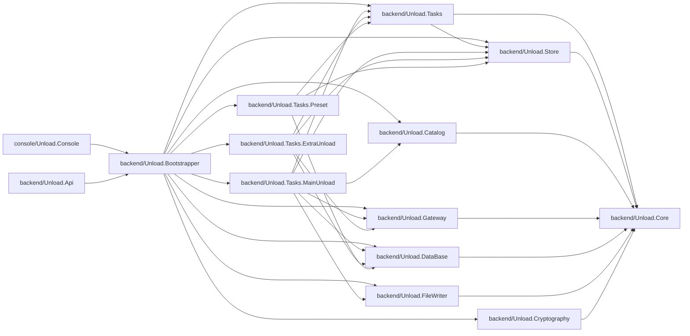
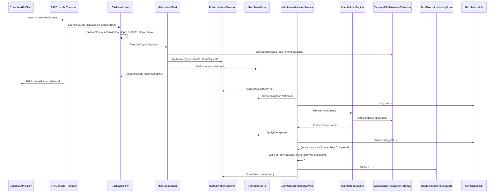

# Unload Architecture

Краткое и прикладное описание: `README.md`.

## Solution modules

- `backend/Unload.Core`
  - Общие контракты и модели домена. Меняется редко.
  - `Domain`: `RunRequest`, `ScriptDefinition`, `DatabaseRow`, `FileChunk`, `WrittenFile`, `RunnerEvent`, `RunnerStep`, `SenderFileDispatchFeedback`, `SenderFeedbackKind`, `SenderBatchStatus`.
  - `Abstractions`: `ICatalogService`, `IDatabaseClient`, `IDatabaseClientFactory`, `IFileChunkWriter`, `IRequestHasher`, `IGatewayPublisher`, `IGatewayBatchSource`, `IGatewaySenderFeedbackSource`, `IGatewaySenderFeedbackConsumer`.

- `backend/Unload.Catalog`
  - Читает `configs/catalog.json`.
  - Опциональная секция `bigScripts`: список `{memberId, groupId}` — target-выборки, чьи скрипты считаются «большими» и выполняются в n-1 потоках.
  - Понимает структуру `groups` + `members` (у `group` есть `folder` и `code`, у `member` есть `groups` и `file`) и строит target-код как `<GROUP_FOLDER>_<MEMBER_CODE>`.
  - Находит SQL-файлы в `scripts/<GROUP_FOLDER>` и отбирает скрипты target-выборки по формату имени `Y<member><group>_<type>_<codes>_<ext>.sql`.
  - `JsonCatalogService` (оркестрация), `CatalogScriptPathHelper` (правила имен и сортировки).

- `backend/Unload.DataBase`
  - Заглушка БД: `StubDatabaseClient`.
  - Фабрика клиентов: `DatabaseClientFactory` (создаёт независимый клиент на каждый worker).
  - `StubDatabaseClient` — для probe-запроса с маркером `PRESET_READY_PROBE` возвращает случайный `0` или `1`.
  - `connectionString` может быть plain-text строкой или строкой формата `dpapi:<base64>`, расшифровываемой через Windows DPAPI (`CurrentUser`).

- `backend/Unload.FileWriter`
  - Запись чанков в файлы с разделителем `|`.
  - Пер-файловая блокировка (keyed lock): один целевой файл пишется строго одним потоком, разные файлы пишутся параллельно.
  - Первая строка файла: `#|{type}|{fileName}|2XMDR|{yyyy-MM-dd}|{rowsCount}|{firstCodeDigit}`.
  - Пишет в `output/<dd_MM_yyyy_HHmmss>/output-files/`.
  - Формат имени файла: `{first3charsOfScript}{dayOfYear:D3}{chunkNumberBase36}.{ext}`.
  - `chunkNumber` — сквозная нумерация по мемберу в рамках запуска (между скриптами одного мембера).

- `backend/Unload.Gateway`
  - FTP-based gateway: публикация файлов, sender-feedback, ручная загрузка.
  - `FtpGatewayPublisher` — реализует `IGatewayPublisher`, `IGatewayBatchSource`, `IGatewaySenderFeedbackSource`.
  - `FtpGatewayBackgroundService` — фоновый обработчик FTP.
  - `GatewayUploadService` — обработка ручной загрузки файлов через `POST /api/system/gateway-upload`.
  - Конфигурация через секцию `Gateway.Ftp` в appsettings (`Host`, `Port`, `Username`, `Password`, `RemoteDirectory`, `StagingDirectory`, `ConnectTimeoutMs`).
  - Заменяет прежнюю in-memory MQ-заглушку (`Unload.MQ`).

- `backend/Unload.Cryptography`
  - `Sha256RequestHasher` для формирования run hash.

- `backend/Unload.Store`
  - Единое хранилище состояний и истории выполнения задач.
  - `RunStateStore` — потокобезопасное in-memory хранилище `RunStatusInfo` по всем запускам `run`. JSON-персистентность в `output/_state/runs.json`. При рестарте незавершённые записи переводятся в `Cancelled`.
    - Методы: `SetStarted`, `SetRunning`, `ApplyEvent`, `ApplySenderFeedback`, `SetFailed`, `SetCancellationRequested`, `SetCancelled`, `Get`, `List`, `PruneTerminalRuns`.
  - `TaskExecutionHistoryStore` — история завершённых задач (`TaskRecord`). JSON-персистентность в `output/_state/task-history.json`.
    - `HasRunToday(taskCode, day)` — используется `TaskWorkflow` для проверки `RequiresCompleted`.
    - Методы: `Add`, `List(day)`, `ListRange`, `TryGetByCorrelationId`, `HasRunToday`, `Prune`.
  - `TaskRecord` — запись завершённой задачи: `TaskCode`, `StartedAt`, `CompletedAt`, `CorrelationId`, `Message`, `ScriptsExecuted`, `FilesWritten`, `OutputPath`.
  - `JsonFileStore<T>` — атомарная JSON-персистентность (write-temp + move). Одна реализация на все хранилища.
  - `GatewaySenderFeedbackConsumer` — реализует `IGatewaySenderFeedbackConsumer`, проецирует feedback в `RunStateStore`.
  - `RequeueService` — повторная публикация результатов прошлых запусков в gateway.
  - Run-модели: `RunStatusInfo`, `RunLifecycleStatus`, `MemberRunStatusInfo`, `MemberRunLifecycleStatus`, `RunWorkerStatusInfo`, `RunOutputArtifactInfo`, `SenderBatchStatusInfo`, `SenderFileDispatchStateInfo`.

- `backend/Unload.Tasks`
  - Ядро задач: абстракция, контроллер, политика окна, вспомогательные модели.
  - `UnloadTask` — абстрактный базовый класс. Свойства:
    - `Code` (abstract) — уникальный код задачи;
    - `RequiresCompleted` — коды задач, которые должны быть успешно завершены сегодня;
    - `ConflictsWith` — коды задач, с которыми нельзя выполняться одновременно;
    - `RequiresDailyWindowOpen` — должно ли быть открыто дневное окно.
  - `TaskWorkflow` — единственный класс оркестрации. Без интерфейса. Последовательность `LaunchAsync`:
    1. резолв задачи по коду (`_tasks[request.TaskCode]`);
    2. проверки ограничений (если не `AdminOverride`): дневное окно, `CanRunPreset` для preset, `RequiresCompleted` через `TaskExecutionHistoryStore`, `ConflictsWith` через `_activeForegroundTaskCodes`, single-active через `RunActivationChannel`;
    3. для foreground-задач: `BeginForeground` → `ExecuteAsync` → `EndForeground`;
    4. для deferred-задачи `run`: только `ExecuteAsync` без foreground-маркировки.
  - `DailyWindowPolicy` — policy дневного окна. Состояние: `PresetGateState`. Методы: `Get`, `StartPolling`, `RefreshDailyWindowState`, `ApplyProbeResult`, `MarkPresetCompleted`, `CanRunPreset(out reason)`, `IsOpen(now)`.
  - `TaskLaunchRequest` — `(TaskCode, AdminOverride, PublishToGateway, Codes, SelectionMode)`.
  - `TaskExecutionResult` — `(TaskCode, ExecutionId, Status, Message, ScriptsExecuted, FilesWritten, OutputPath)`.
  - `TaskExecutionStatus` — `Accepted, Running, Completed, Failed, Cancelled, Blocked`.
  - `TaskLaunchException` — `FailureKind` (`Validation`/`Conflict`), `ErrorCode`, `Extensions`.
  - `TaskLaunchFailureKind` — `Validation`, `Conflict`.
  - `TaskCodes` — константы `run`, `preset`, `extra`, `probe`.
  - `RunActivationChannel` — in-memory канал single-active задачи `run`. Методы: `TryActivate`, `ReadActivationsAsync`, `Complete`, `GetActiveCorrelationId`, `TryCancel`.
  - `RunActivation` — `(CorrelationId, Payload: RunRequest, CancellationToken)`.
  - `RunSelectionMode` — `MemberCodes`, `TargetCodes`.
  - `PresetGateOptions` — конфигурация polling (`Enabled`, `StartHour`, `StartMinute`, `PollIntervalSeconds`, `ProbeSql`).
  - `PresetGateState` — DTO состояния для UI и SignalR (`Enabled`, `PollingStarted`, `RequiresPresetExecution`, `ReadyForPreset`, `PresetCompleted`, `LastProbeValue`, `LastProbeAt`, `Message`). Имя DTO сохранено: на него завязан SignalR-контракт `preset_state` и Angular.
  - `ScriptTaskRunResult` — результат script-задачи для HTTP-ответа (`TaskName`, `CorrelationId`, `ScriptsExecuted`, `FilesWritten`, `OutputPath`, `Message`).

- `backend/Unload.Tasks.MainUnload`
  - `MainUnloadTask` — задача `run`. `RequiresCompleted: [preset]`, `ConflictsWith: [preset]`, `RequiresDailyWindowOpen: true`. Deferred: активирует `RunActivationChannel` и возвращает `Accepted`.
  - `MainUnloadEngine` — движок выгрузки (переименование `RunnerEngine`). N worker-потоков, `ScriptDistributor` (big/light очереди), `RunnerEventEmitter` (Channel + Task), `RunnerEngineGuard`, `RunnerOutputDirectoryFactory`, `RunReportCsvWriter`.
  - `RunRequestFactory` — создаёт `RunRequest` с корреляционным ID.
  - `RunnerOptions` — `WorkerCount` (по умолчанию 4), `ChunkSizeBytes` (по умолчанию 10 МБ).
  - `RunApplicationOptions` — options для запуска (`OutputDirectory`).
  - `RunAlreadyInProgressException`.

- `backend/Unload.Tasks.ExtraUnload`
  - `ExtraUnloadTask` — задача `extra`. `RequiresCompleted: [preset]`, `ConflictsWith: [preset]`, `RequiresDailyWindowOpen: true`. Синхронная.
  - `ExtraScriptExecutor` — выполняет один extra-скрипт с агрегацией строк по `NrBank`.
  - `ExtraOutputWriter` — пишет агрегированные файлы.
  - `ExtraScriptExecutionResult`, `ExtraOutputWriteResult` — модели результатов.

- `backend/Unload.Tasks.Preset`
  - `ProbeTask` — задача `probe`. Без зависимостей и конфликтов, не требует дневного окна. Выполняет SQL из `PresetGateOptions.ProbeSql`, применяет результат к `DailyWindowPolicy`, фиксирует в `TaskExecutionHistoryStore`.
  - `PresetTask` — задача `preset`. `RequiresCompleted: [probe]`, `ConflictsWith: [run, extra]`, `RequiresDailyWindowOpen: false` (особая проверка через `DailyWindowPolicy.CanRunPreset`). Выполняет SQL-скрипты из `scripts/preset`, вызывает `DailyWindowPolicy.MarkPresetCompleted()`.
  - `PresetScriptExecutor` — выполняет один preset-скрипт.
  - `PresetTaskOptions` — `ScriptsDirectory`.

- `backend/Unload.Bootstrapper`
  - `AddUnloadRuntime(IServiceCollection, IConfiguration)` — единственная точка регистрации всех runtime-сервисов. Используется `Unload.Api/Program.cs` и `Unload.Console/Program.cs`.
  - `UnloadConfiguration` — агрегат: `(Paths, Database, Runner, PresetGate, HistoryRetention)`.
  - `UnloadConfigurationLoader.Load(IConfiguration)` — резолвит корень workspace (ищет `configs/catalog.json` + `scripts/` вверх по дереву), биндит все секции. Выбрасывает `DirectoryNotFoundException` если workspace не найден.
  - `UnloadRuntimePaths` — `(CatalogPath, ScriptsDirectory, OutputDirectory)`.
  - `DatabaseRuntimeSettings` — секция `Database` (`TimeoutSeconds`, `ConnectionString`). Обязательна.
  - `HistoryRetentionOptions` — секция `HistoryRetention` (`RetentionDays`).

- `backend/Unload.Api`
  - ASP.NET Core API + SignalR. Тонкий транспортный слой без бизнес-оркестрации.
  - `RunsController` (`/api/runs*`) — запуск, остановка, статусы, история, dashboard, requeue. Вызывает `TaskWorkflow` напрямую.
  - `CatalogController` (`/api/catalog`, `/api/members`) — каталог и список мемберов.
  - `SystemController` (`/api/system/*`) — серверное время, скачивание файлов, gateway-upload, sender-feedback.
  - `RunStatusHub` (`/hubs/status`) — SignalR hub.
  - `MainUnloadHostedService` — читает `RunActivationChannel`, гоняет `MainUnloadEngine`, обновляет `RunStateStore`, публикует SignalR. Фиксирует завершение `run` в `TaskExecutionHistoryStore`.
  - `ProbeSchedulerHostedService` — по расписанию вызывает `TaskWorkflow.LaunchAsync(probe)`, публикует `preset_state` в SignalR. Использует `PeriodicTimer`.
  - `SenderFeedbackProjectionBackgroundService` — получает события от `IGatewaySenderFeedbackSource`, проецирует в `RunStateStore` через `IGatewaySenderFeedbackConsumer`, публикует `run_status`.
  - `HistoryRetentionBackgroundService` — удаляет старые записи из хранилищ по расписанию.
  - `OutputFilesService` — безопасный доступ к файлам output (проверяет выход за пределы директории).
  - `GlobalExceptionHandler`, `ApiProblemDetailsFactory`, `ApiProblemException`, `TaskLaunchExceptions` — единый error handling.
  - HTTP-контракты: `RunStartRequest`, `RunAcceptedResponse`, `AdminTaskRequest`, `MemberCatalogItem`, `WorkflowDashboardSnapshotResponse`, `WorkflowHistoryResponse`.
  - Логи через NLog: CSV-файл `logs/api-<date>.csv` (колонки: `timestamp`, `level`, `traceId`, `logger`, `message`, `exception`) + консоль.

- `console/Unload.Console`
  - Локальный запуск через DI того же runtime (`AddUnloadRuntime`).
  - По умолчанию интерактивная сессия стадий (`probe -> preset -> run -> extra`).
  - One-shot режимы: `--preset`, `--extra`.
  - С аргументами target-кодов: `dotnet run ... -- QQW,QQE` (запускает run по target-кодам).
  - Ключевые типы из backend: `TaskWorkflow`, `TaskLaunchRequest`, `TaskCodes`, `RunActivationChannel`, `RunStateStore`, `MainUnloadEngine`, `RunActivation`, `RunnerOptions`, `DailyWindowPolicy`, `PresetGateOptions`, `PresetGateState`, `UnloadConfiguration`.
  - Отображение через `Spectre.Console`: live-таблица worker-потоков + глобальные логи (последние 15 событий).
  - После завершения выводит `Total export time` в формате `hh:mm:ss.fff`.
  - `TargetCodePrompter` — интерактивный multi-select target-кодов по каталогу.

- `console/Unload.WebConsole`
  - CLI-клиент к API через HTTP (`/api/runs`, `/api/members`, `/api/runs/active`, `/api/runs/{id}`) + SignalR (`/hubs/status`).
  - Ссылается на backend-проекты `Unload.Api`, `Unload.Store`, `Unload.Tasks`, `Unload.Tasks.MainUnload` — переиспользует их модели/DTO вместо локальных дублей.
  - Поддерживает `--preset`, `--extra`, `--members`.
  - Типы: `AppOptions`, `RunApiClient`, `RunDashboardBuilder`, `UiState`, `WebConsoleRunner`.

- `console/Unload.FtpServer`
  - Вспомогательный FTP-сервер для разработки и тестирования gateway.
  - Без project reference на backend-проекты.

- `console/Unload.GatewayHandler`
  - Обработчик файлов со стороны gateway.
  - Без project reference на backend-проекты.

- `web/webApp`
  - Angular 21 standalone frontend. UI-стек: PrimeNG 21, Tailwind CSS 4, `@microsoft/signalr`.

## Module diagram


```mermaid
flowchart LR
    Console["console/Unload.Console"] --> Bootstrapper["backend/Unload.Bootstrapper"]
    Api["backend/Unload.Api"] --> Bootstrapper

    Bootstrapper --> Tasks["backend/Unload.Tasks"]
    Bootstrapper --> MainUnload["backend/Unload.Tasks.MainUnload"]
    Bootstrapper --> ExtraUnload["backend/Unload.Tasks.ExtraUnload"]
    Bootstrapper --> Preset["backend/Unload.Tasks.Preset"]
    Bootstrapper --> Store["backend/Unload.Store"]
    Bootstrapper --> Catalog["backend/Unload.Catalog"]
    Bootstrapper --> Db["backend/Unload.DataBase"]
    Bootstrapper --> Writer["backend/Unload.FileWriter"]
    Bootstrapper --> Gateway["backend/Unload.Gateway"]
    Bootstrapper --> Crypto["backend/Unload.Cryptography"]

    Tasks --> Store
    Tasks --> Core["backend/Unload.Core"]
    Store --> Core
    MainUnload --> Tasks
    MainUnload --> Store
    MainUnload --> Catalog
    MainUnload --> Db
    MainUnload --> Writer
    MainUnload --> Gateway
    ExtraUnload --> Tasks
    ExtraUnload --> Store
    ExtraUnload --> Db
    ExtraUnload --> Gateway
    Preset --> Tasks
    Preset --> Store
    Preset --> Db
    Catalog --> Core
    Gateway --> Core
    Db --> Core
    Writer --> Core
    Crypto --> Core
```

## Execution flow

1. Console или API вызывают `TaskWorkflow.LaunchAsync(request)`.
2. `TaskWorkflow` проверяет ограничения запуска в строгом порядке:
   - задача резолвится по коду;
   - если не `AdminOverride`: дневное окно, `CanRunPreset` для preset, `RequiresCompleted` через `TaskExecutionHistoryStore.HasRunToday`, `ConflictsWith` через `_activeForegroundTaskCodes`, single-active `run` через `RunActivationChannel`;
   - при нарушении любого условия бросается `TaskLaunchException`.
3. Для foreground-задач (`preset`, `extra`, `probe`) код задачи добавляется в `_activeForegroundTaskCodes` на время выполнения, удаляется после.
4. `task.ExecuteAsync(request, ct)` вызывается.
5. Для deferred-задачи `run`:
   - `MainUnloadTask.ExecuteAsync` активирует `RunActivationChannel.TryActivate` и создаёт запись в `RunStateStore`;
   - возвращает `TaskExecutionStatus.Accepted`;
   - `MainUnloadHostedService` читает активацию из канала и запускает `MainUnloadEngine`.
6. `MainUnloadEngine` эмитит `RunnerEvent` (через `Channel<RunnerEvent>` + `RunnerEventEmitter`).
7. `MainUnloadHostedService` применяет события через `RunStateStore.ApplyEvent` и публикует `status` + `run_status` в SignalR.
8. Big scripts (из `bigScripts`) выполняются в n-1 потоках, остальные — в оставшихся; каждый worker в цикле запрашивает следующий скрипт у `ScriptDistributor`.
9. После завершения `MainUnloadEngine` файлы публикуются в FTP gateway; `SenderFeedbackProjectionBackgroundService` проецирует feedback в `RunStateStore.ApplySenderFeedback`, что запускает `TryPromoteToCompleted` для перехода в terminal-статус.
10. `MainUnloadHostedService` записывает итог в `TaskExecutionHistoryStore`, освобождает `RunActivationChannel`.
11. При `POST /api/runs/{correlationId}/stop` статус переходит в `CancellationRequested`; после фактической остановки — в terminal `Cancelled`.

## Каталог и bigScripts

В `configs/catalog.json` опциональная секция `bigScripts` задаёт target-выборки (memberId+groupId):

```json
"bigScripts": [
  { "memberId": 1, "groupId": 1 }
]
```

Скрипты таких target-кодов выполняются в n-1 потоках; 1 поток всегда резервируется для легких скриптов.

## Форматы имен и выходных файлов

### Формат SQL-скрипта

- `Y<memberCode><groupCode>_<type>_<codes>_<extension>.sql`
- `Y` — константный префикс.
- `<memberCode>` — код мембера (2-й символ имени).
- `<groupCode>` — код группы из `catalog.json` (3-й символ имени).
- `<type>` — тип выгрузки, используется в заголовке output-файла.
- `<codes>` — один или несколько числовых кодов, разделённых `_` (например, `01` или `01_2_15`).
- `<extension>` — расширение output-файла без точки.

### Формат выходного файла

- Имя: `{first3charsOfScript}{dayOfYear:D3}{chunkNumberBase36}.{extension}`
- `chunkNumberBase36` — сквозной номер чанка для конкретного мембера в рамках запуска, в верхнем регистре base36 (`01`, `02`, ... `09`, `0A`, `0B`, ...).
- При коллизии имени добавляется суффикс `_{NN}`.
- Первая строка:
  - `#|{type}|{outputFileName}|2XMDR|{yyyy-MM-dd}|{rowsCountWithoutHeader}|{firstDigitFromCodes}`
- Остальные строки: данные из БД через `|` без экранирования.

### Структура output и CSV-отчёта

- Папка запуска: `output/<dd_MM_yyyy_HHmmss>/`
- Выходные файлы чанков: `output/<dd_MM_yyyy_HHmmss>/output-files/`
- CSV-отчёт: `output/<dd_MM_yyyy_HHmmss>/run-report.csv`
- Формат CSV:
  - `memberName,fileType,operation,outputFileName,rowsCount,mqStatus,executionTimeMs`
  - `mqStatus`: `отправлен` / `не отправлен`
  - `operation` маппится из `firstCodeDigit`: `0 -> предоставление`, `2 -> замена`, остальные — число.
  - Для скриптов без строк: `outputFileName=""`, `rowsCount=0`, `mqStatus=не отправлен`, `executionTimeMs=0`.

## Run sequence diagram


```mermaid
sequenceDiagram
    participant Client as Console/API Client
    participant Transport as API/Console Transport
    participant Workflow as TaskWorkflow
    participant Task as MainUnloadTask
    participant Channel as RunActivationChannel
    participant Store as RunStateStore
    participant Worker as MainUnloadHostedService
    participant Engine as MainUnloadEngine
    participant Infra as Catalog/DB/FileWriter/Gateway
    participant History as TaskExecutionHistoryStore
    participant SignalR as RunStatusHub

    Client->>Transport: start run(memberCodes)
    Transport->>Workflow: LaunchAsync(TaskLaunchRequest{run})
    Workflow->>Workflow: EnsureCanLaunch (window, deps, conflicts, single-active)
    Workflow->>Task: ExecuteAsync(request)
    Task->>Infra: GetCatalogAsync (если MemberCodes)
    Task->>Channel: TryActivate(correlationId, RunRequest)
    Task->>Store: SetStarted(correlationId, ...)
    Task-->>Workflow: TaskExecutionResult{Accepted}
    Transport-->>Client: 202 Accepted + correlationId

    Worker->>Channel: ReadActivationsAsync()
    Worker->>Store: SetRunning(correlationId)
    Worker->>SignalR: run_status
    Worker->>Engine: RunAsync(request)
    Engine->>Infra: catalog/db/file operations
    Engine-->>Worker: RunnerEvent stream
    Worker->>Store: ApplyEvent(event)
    Worker->>SignalR: status + run_status

    Engine-->>Worker: (stream ends — RunnerStep.Completed)
    Worker->>Worker: WaitForTerminalStateAsync (gateway feedback)
    Worker->>History: Add(run, ...)
    Worker->>Channel: Complete(correlationId)
```

## API endpoints

| Метод | Путь | Описание |
|---|---|---|
| `POST` | `/api/runs` | Запуск `run`. Тело: `RunStartRequest{memberCodes, targetCodes?, adminOverride, publishToGateway}`. Ответ: `202 RunAcceptedResponse` или `409` |
| `GET` | `/api/runs/preset/state` | Состояние дневного окна (`PresetGateState`) |
| `POST` | `/api/runs/preset` | Запуск `preset`. Тело: `AdminTaskRequest?{adminOverride}`. Ответ: `200 ScriptTaskRunResult` |
| `POST` | `/api/runs/extra` | Запуск `extra`. Тело: `AdminTaskRequest?{adminOverride, publishToGateway}`. Ответ: `200 ScriptTaskRunResult` |
| `POST` | `/api/runs/requeue` | Повторная публикация результатов в gateway |
| `GET` | `/api/runs` | Список всех запусков (`RunStatusInfo[]`) |
| `GET` | `/api/runs/today` | Запуски `run` за текущий день |
| `GET` | `/api/runs/dashboard` | Snapshot для UI (`WorkflowDashboardSnapshotResponse`) |
| `GET` | `/api/runs/history` | История за N дней (`?days=N`). Ответ: `WorkflowHistoryResponse` |
| `GET` | `/api/runs/active` | Активный `run` или `{correlationId: null}` |
| `GET` | `/api/runs/{correlationId}` | Статус конкретного `run` |
| `POST` | `/api/runs/{correlationId}/stop` | Запрос остановки `run`. Ответ: `202` или `404` |
| `GET` | `/api/catalog` | Структура каталога |
| `GET` | `/api/members` | Список мемберов с target-кодами и активным статусом |
| `GET` | `/api/system/time` | Серверное время (`ServerTimeResponse`) |
| `POST` | `/api/system/sender-feedback` | Ручная подача sender-feedback (`SenderFeedbackRequest`) |
| `POST` | `/api/system/gateway-upload` | Загрузка файлов в gateway (`multipart/form-data`: files, memberName) |
| `GET` | `/api/system/download?path=` | Скачивание файла из output |
| `GET` | `/api/system/output-files?path=` | Листинг файлов в output-папке |
| `GET` | `/api/system/download-archive?path=` | Скачивание ZIP-архива output-папки |

SignalR hub: `/hubs/status`

| Событие | Payload | Описание |
|---|---|---|
| `status` | `RunnerEvent` | Пошаговые события раннера для всех клиентов |
| `run_status` | `RunStatusInfo` | Обновления агрегированного статуса запуска |
| `preset_state` | `PresetGateState` | Состояние дневного окна |
| `preset_replayed` | `ScriptTaskRunResult` | Результат повторного запуска уже выполненного preset |

Формат ошибок (`application/problem+json`):
- поля: `type`, `title`, `status`, `detail`, `instance`;
- расширения: `errorCode`, `traceId`;
- дополнительные расширения: `activeCorrelationId` (конфликт run), `requiredTaskCodes` (зависимость).
- примеры `errorCode`: `RUN_ALREADY_IN_PROGRESS`, `VALIDATION_ERROR`, `PRESET_GATE_BLOCKED`, `TASK_DEPENDENCY_NOT_SATISFIED`, `TASK_ALREADY_RUNNING`, `RUN_NOT_FOUND`, `UNKNOWN_MEMBER_CODES`.

## Code documentation

- Во всех ключевых классах и методах backend/console добавлены XML-комментарии.
- Комментарии описывают: где используется компонент; как работает метод или класс; `param` и `returns` для методов.
- Поддерживать при добавлении новых публичных и приватных методов core runtime.
- При изменении payload или событий синхронно обновлять `docs/ARCHITECTURE.md`, `README.md` и `postman/unload-api.postman_collection.json`.

## Extension contracts

Чеклист для добавления новых API функций без деградации поддерживаемости:

1. Новую задачу реализовывать как подкласс `UnloadTask`, декларируя ограничения на уровне свойств класса.
2. Воркфлоу `TaskWorkflow` автоматически исполняет ограничения — задача не должна вызывать gate-проверки сама.
3. Для бизнес-ошибок бросать `TaskLaunchException`; в контроллере — `ApiProblemException`. Не собирать `ProblemDetails` вручную.
4. Новые `errorCode` фиксировать в docs в стиле `UPPER_SNAKE_CASE`.
5. Если нужен live-статус для UI — публиковать событие в `RunStatusHub` с именем в стиле существующих (`status`, `run_status`, `preset_state`).
6. Для run-статусов соблюдать переходы `Running -> CancellationRequested -> Cancelled` и terminal-статусы без обратного перехода.
7. Для output-артефактов использовать отдельный writer-компонент, не смешивая SQL execution и файловую запись.

## API run

Запуск API из корня solution:

```powershell
dotnet run --project .\backend\Unload.Api\Unload.Api.csproj
```

Пример запуска выгрузки:

```powershell
curl -X POST http://localhost:5000/api/runs -H "Content-Type: application/json" -d "{\"memberCodes\":[\"M\"]}"
```

Проверка состояния дневного окна:

```powershell
curl http://localhost:5000/api/runs/preset/state
```

Запуск preset-задачи:

```powershell
curl -X POST http://localhost:5000/api/runs/preset
```

Запуск extra-задачи:

```powershell
curl -X POST http://localhost:5000/api/runs/extra
```

Получение списка доступных мемберов:

```powershell
curl http://localhost:5000/api/members
```

Остановка активной выгрузки:

```powershell
curl -X POST http://localhost:5000/api/runs/{correlationId}/stop
```

Проверка статусов запусков:

```powershell
curl http://localhost:5000/api/runs
```

Проверка активного запуска:

```powershell
curl http://localhost:5000/api/runs/active
```

SignalR — подключение:

- Подключиться к `/hubs/status`.
- Вызвать `SubscribeRun(correlationId)` (опционально, для обратной совместимости).
- Слушать `status` — `RunnerEvent` для всех клиентов.
- Слушать `run_status` — `RunStatusInfo` для всех клиентов.
- Слушать `preset_state` — `PresetGateState` для всех клиентов.

## Run

Из корня solution:

```powershell
dotnet run --project .\console\Unload.Console\Unload.Console.csproj
```

Команда выше запускает единый stage-интерфейс (без перезапуска приложения между фазами): `probe`, `preset`, `run`, `extra`.

С указанием target-кодов:

```powershell
dotnet run --project .\console\Unload.Console\Unload.Console.csproj -- QQW,QQE
```

Локальный запуск preset-задачи:

```powershell
dotnet run --project .\console\Unload.Console\Unload.Console.csproj -- --preset
```

Локальный запуск extra-задачи:

```powershell
dotnet run --project .\console\Unload.Console\Unload.Console.csproj -- --extra
```

## WebConsole

Запуск web-клиента для API:

```powershell
dotnet run --project .\console\Unload.WebConsole\Unload.WebConsole.csproj -- --api http://localhost:5000 --members M
```

Режим наблюдения за уже активной выгрузкой:

```powershell
dotnet run --project .\console\Unload.WebConsole\Unload.WebConsole.csproj -- --api http://localhost:5000
```

Запуск preset-задачи из WebConsole:

```powershell
dotnet run --project .\console\Unload.WebConsole\Unload.WebConsole.csproj -- --api http://localhost:5000 --preset
```

Запуск extra-задачи из WebConsole:

```powershell
dotnet run --project .\console\Unload.WebConsole\Unload.WebConsole.csproj -- --api http://localhost:5000 --extra
```

## Angular WebApp

Запуск web-клиента:

```powershell
cd .\web\webApp
npm start
```

Dev-server поднимается на `http://localhost:4200` и через proxy проксирует:

- `/api/*` -> `http://localhost:5000`
- `/hubs/*` -> `http://localhost:5000`
