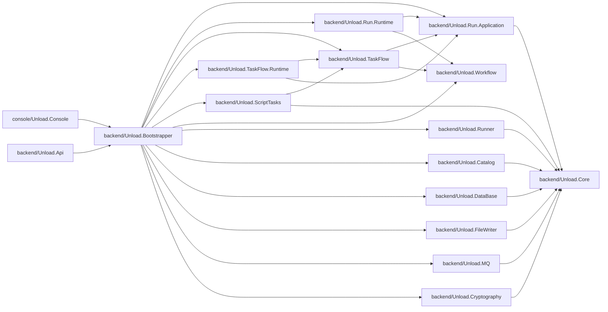
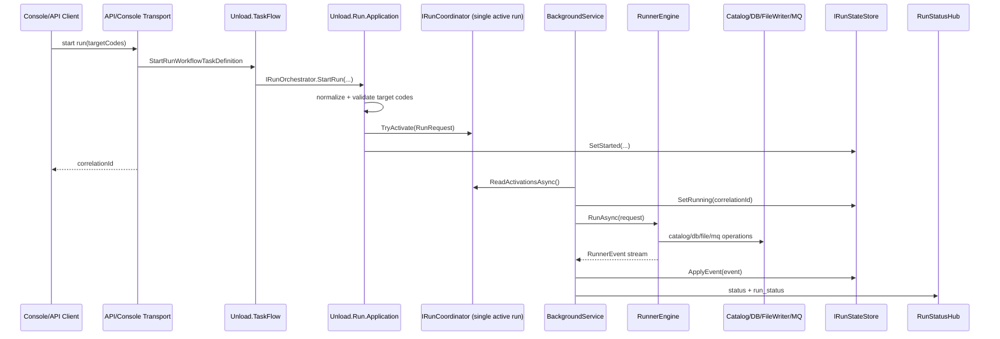

# Unload Architecture

Краткое и прикладное описание проекта для быстрого старта: `README.md`.

## Solution modules

- `backend/Unload.Core`
  - Общие контракты и модели домена.
  - `Domain`: `RunRequest`, `ScriptDefinition`, `DatabaseRow`, `FileChunk`, `WrittenFile`, `RunnerEvent`, `RunnerStep`.
  - `Abstractions`: интерфейсы `IRunner`, `ICatalogService`, `IDatabaseClient`, `IDatabaseClientFactory`, `IFileChunkWriter`, `IMqPublisher`, `IRequestHasher`.

- `backend/Unload.Catalog`
  - Читает `configs/catalog.json`.
  - Опциональная секция `bigScripts`: список `{memberId, groupId}` — target-выборки, чьи скрипты считаются «большими» и выполняются в n-1 потоках.
  - Понимает структуру `groups` + `members` (у `group` есть `folder` и `code`, у `member` есть `groups` и `file`) и строит target-код как `<GROUP_FOLDER>_<MEMBER_CODE>`.
  - Находит SQL-файлы в `scripts/<GROUP_FOLDER>` и отбирает скрипты target-выборки по формату имени `Y<member><group>_<type>_<codes>_<ext>.sql`.
  - Значения `folder`, `code`, `file` используются как есть, без `trim`/приведения регистра.
  - Проверки формата `group.folder`, `member.code`, `targetCode` отключены; защита от выхода за границы директории скриптов сохранена.
  - Для поддержки читаемости разнесено по файлам: `JsonCatalogService` (оркестрация), `CatalogScriptPathHelper` (правила имен и сортировки скриптов).
  - Построение `CatalogInfo` внутри `JsonCatalogService` декомпозировано на небольшие шаги (`BuildMemberGroupCodes`, `BuildTargets`, `BuildGroups`, `BuildMembers`) вместо длинных LINQ-цепочек.

- `backend/Unload.DataBase`
  - Заглушка БД: `StubDatabaseClient`.
  - Фабрика клиентов: `DatabaseClientFactory` (создает независимый клиент на каждый worker).
  - `StubDatabaseClient` поддерживает конструктор `StubDatabaseClient(int timeout, string connectionString)`.
  - Для probe-запроса с маркером `PRESET_READY_PROBE` заглушка возвращает случайный `0` или `1` с вероятностью 50/50.
  - `connectionString` может быть:
    - plain-text строкой подключения;
    - строкой формата `dpapi:<base64>`, которая расшифровывается через Windows DPAPI (`CurrentUser`).
  - Контракты БД: `IDatabaseClient` (`IsConnected`, `GetDataReaderAsync(...)`) и `IDatabaseClientFactory` (`CreateClient()`).
  - В раннер передается `DbDataReader`, строки читаются потоково.

- `backend/Unload.FileWriter`
  - Запись чанков в файлы с расширением из имени SQL/`member.file` и разделителем `|`.
  - На уровне writer используется пер-файловая блокировка (keyed lock): один и тот же целевой файл пишется строго одним потоком, разные файлы пишутся параллельно.
  - Каждый файл открывается эксклюзивно (`FileMode.CreateNew`, `FileShare.None`), поэтому один конкретный файл всегда пишется только одним потоком.
  - Первая строка файла — служебный заголовок: `#|{type}|{fileName}|2XMDR|{yyyy-MM-dd}|{rowsCount}|{firstCodeDigit}`.
  - Начиная со второй строки пишутся данные из БД через `|`.
  - Пишет в `output/<dd_MM_yyyy_HHmmss>/output-files/`.
  - Формат имени файла: `{first3charsOfScript}{dayOfYear:D3}{chunkNumberBase36}.{ext}` (без `_`).
  - `chunkNumber` ведется сквозной нумерацией по мемберу в рамках запуска (между скриптами одного мембера).

- `backend/Unload.MQ`
  - Заглушка MQ: `InMemoryMqPublisher`.
  - Сохраняет события раннера во внутреннюю очередь.

- `backend/Unload.Cryptography`
  - `Sha256RequestHasher` для формирования run hash.

- `backend/Unload.Runner`
  - `RunnerEngine` + `RunnerOptions`.
  - N worker-потоков (настраиваемо через `WorkerCount`, по умолчанию 4), каждый с одним `IDatabaseClient`.
  - Worker-задачи запускаются через `Task.Run`, чтобы стартовать параллельно даже при синхронно-блокирующих реализациях `IDatabaseClient`.
  - **Большие скрипты** (из `catalog.json` → `bigScripts`): target-выборки (memberId+groupId) выполняются в n-1 потоках; 1 поток всегда для легких скриптов.
- Внутренний `ScriptDistributor` хранит две очереди (`big`, `light`) и выдает следующий скрипт по простому правилу: worker запрашивает задачу с предпочтением (`big-first`/`light-first`), если в предпочтительной очереди пусто — сразу получает скрипт из второй.
  - В событиях `QueryStarted`/`QueryCompleted` указывается `Worker #N`.
  - Один MQ-публикатор: все worker-ы передают события в общий канал.
  - Шаги: resolve target-кодов -> big/light очереди -> worker-ы (запросы БД, чанки, запись, MQ).
  - Значения по умолчанию: `ChunkSizeBytes = 10MB`, `WorkerCount = 4`.
  - Чтение всегда потоковое: буфер ограничен текущим чанком.
  - После каждого шага создается `RunnerEvent`.
  - Формирует CSV-отчет `run-report.csv` с полями: `memberName,fileType,operation,outputFileName,rowsCount,mqStatus,executionTimeMs`.
  - Для скриптов с `0` строк добавляет запись в отчет (`outputFileName` пустой, `rowsCount=0`, `mqStatus=не отправлен`, `executionTimeMs=0`).
  - `operation` маппится из `firstCodeDigit`: `0 -> предоставление`, `2 -> замена`, остальные — число.
  - `mqStatus` фиксирует факт отправки в MQ; при ошибке MQ пайплайн продолжает выполнение.
  - Внутренние детали: `RunnerEngine`, `RunnerEventEmitter` (Channel + Task), `RunnerEngineGuard`, `RunnerOutputDirectoryFactory`, `RunnerEngineDataReader`.

- `backend/Unload.Run.Application`
  - Application-слой основного `run`.
  - Контракты и orchestration: `IRunOrchestrator`, `IRunRequestFactory`, `IRunCoordinator`, `IRunStateStore`.
  - Контракт и модели runtime-статусов: `RunStatusInfo`, `RunLifecycleStatus`, `MemberRunStatusInfo`, `RunWorkerStatusInfo`, `RunOutputArtifactInfo`.
  - `RunOrchestrator` нормализует target-коды, формирует `RunRequest`, резервирует слот единственного активного запуска и создает стартовый статус.

- `backend/Unload.Run.Runtime`
  - In-memory runtime реализации основного `run`.
  - `InMemoryRunCoordinator` — один активный run без очереди ожидания, с токеном отмены конкретной активации.
  - `InMemoryRunStateStore` — состояние запусков, мемберов, worker-ов и output-артефактов.

- `backend/Unload.TaskFlow`
  - Orchestration-слой пользовательских задач и прозрачной настройки pipeline.
  - Контракты task executor-ов: `IScriptTaskOrchestrator`, `ScriptTaskRunResult`.
  - Централизованные workflow definitions для пользовательских задач:
    - `StartRunWorkflowTaskDefinition`
    - `RunPresetWorkflowTaskDefinition`
    - `RunExtraWorkflowTaskDefinition`
  - Общие коды задач и моделей workflow: `WorkflowTaskCodes`, `WorkflowStageCodes`, `StartRunTaskRequest`, `StartRunTaskResult`, `EmptyWorkflowTaskRequest`, `WorkflowTaskDispatchException`.
  - Pipeline-конфигурация в одном месте:
    - `TaskPipelineConfigurator` — единая декларация порядка, зависимостей, конфликтов и post-actions;
    - `TaskPipelineBuilder` / `TaskPipeline` — fluent API и runtime-представление pipeline;
    - `WorkflowTaskDependencyCatalog` — rule-каталог, собранный из pipeline-конфигурации.
  - Подготовлен extension point для автопереходов после завершения задач:
    - `IWorkflowTaskTransitionService` / `WorkflowTaskTransitionService`;
    - `IWorkflowTaskTransitionHandler`;
    - `WorkflowTaskCompletionContext`.
  - Preset-gate use-case: `IPresetGateService` / `PresetGateService`, `PresetGateOptions`, `PresetGateState`.
    - Хранит in-memory состояние, правила временного окна и требования ежедневного `preset`.
    - Проверяет разрешение на запуск `preset`/`run`/`extra` и формирует причины блокировки.

- `backend/Unload.TaskFlow.Runtime`
  - In-memory runtime реализации task orchestration.
  - `IWorkflowTaskAccessService` / `InMemoryWorkflowTaskAccessService` — проверка порядка, таблицы конфликтов и фиксация completed tasks.
  - `IWorkflowStageStateStore` / `InMemoryWorkflowStageStateStore` — состояние системных workflow-стадий.

- `backend/Unload.ScriptTasks`
  - Инфраструктурные реализации дополнительных задач `preset` и `extra`.
  - Проект больше не маскируется под application namespace и явно выступает implementation-of-port для `Unload.TaskFlow`.
  - `ScriptTaskOrchestrator` выполняет:
    - `preset`: SQL-скрипты из `scripts/preset`;
    - `extra`: SQL-скрипты из корня `scripts` (без подпапок), агрегацию по `NrBank`, запись `LineFile`.
  - Декомпозиция по отдельным компонентам:
    - `IPresetScriptExecutor` / `PresetScriptExecutor` — выполнение одного preset-скрипта;
    - `IExtraScriptExecutor` / `ExtraScriptExecutor` — выполнение одного extra-скрипта с агрегацией строк;
    - `IExtraOutputWriter` / `ExtraOutputWriter` — запись агрегированных файлов extra-задачи;
    - `IScriptTaskEventPublisher` / `ScriptTaskEventPublisher` — публикация `RunnerEvent` для доп-задач.

- `backend/Unload.Bootstrapper`
  - DI-композиция runtime через `AddUnloadRuntime(UnloadRuntimePaths, DatabaseRuntimeSettings, RunnerOptions, PresetGateOptions)` для API и Console.
  - Собирает вместе `Unload.Run.Application`, `Unload.Run.Runtime`, `Unload.TaskFlow`, `Unload.TaskFlow.Runtime`, `Unload.ScriptTasks`, `Unload.Workflow` и инфраструктурные проекты.
  - Регистрация `IWorkflowTaskRegistry` и `IWorkflowTaskDispatcher`.
  - Настройки БД валидируются при старте (`TimeoutSeconds > 0`, непустой `ConnectionString`), fallback-значения не используются.

- `backend/Unload.Workflow`
  - Глобальный single-active workflow pipeline для фоновых задач.
  - Базовые контракты: `ISingleActiveWorkflow<TPayload>`, `WorkflowActivation<TPayload>`.
  - In-memory реализация: `InMemorySingleActiveWorkflow<TPayload>`.
  - Реестр и диспетчер задач верхнего уровня:
    - `IWorkflowTaskDefinition`
    - `IWorkflowTaskRegistry`
    - `IWorkflowTaskDispatcher`
    - `WorkflowTaskRegistry`
    - `WorkflowTaskDispatcher`

- `backend/Unload.Api`
  - ASP.NET Core API + SignalR.
  - Тонкий транспортный слой: HTTP/SignalR, без бизнес-оркестрации запуска.
  - Единый контракт ошибок через `ProblemDetails` + глобальный exception handler + `IApiProblemDetailsFactory`.
  - Контроллер `RunsController` оставлен тонким; бизнес-ветки вынесены в use-case классы:
    - `IStartRunUseCase` / `StartRunUseCase`;
    - `IRunPresetUseCase` / `RunPresetUseCase`;
    - `IRunExtraUseCase` / `RunExtraUseCase`.
  - HTTP-эндпоинты вынесены в MVC-контроллеры: `CatalogController` (`/api/catalog`, `/api/members`), `RunsController` (`/api/runs*`) и `SystemController` (`/api/system/time`).
  - Настройки БД читаются из секции `Database` (`TimeoutSeconds`, `ConnectionString`) в `appsettings.Development.json` / `appsettings.Production.json`; секция обязательна.
  - `GET /api/catalog` — отдает структуру каталога (группы, участники, target-выборки), где:
    - `group.name` отдается в формате `{имя (folder)}`;
    - `member.name` отдается в формате `{имя (Y{memberCode}{groupCode}*.ext)}`.
  - `GET /api/members` — отдает список мемберов для запуска (`code`, `name`, `targetCodes`) и, если есть активный запуск, текущий статус мембера (`activeRunCorrelationId`, `activeRunStatus`).
  - `GET /api/system/time` — отдает локальное время backend-сервера и timezone metadata для UI-клиентов.
  - `GET /api/system/download?path=...` — отдает файл из `output`, проверяя, что запрошенный путь не выходит за границы runtime output directory.
  - `POST /api/runs` — запускает выгрузку для выбранных мемберов (`memberCodes`) и возвращает `correlationId`.
  - `GET /api/runs/preset/state` — состояние preset-гейта (расписание, готовность, блокировка).
  - `POST /api/runs/preset` — запускает preset-задачу.
  - `POST /api/runs/extra` — запускает extra-задачу root-скриптов.
  - Если запуск уже выполняется, `POST /api/runs` возвращает `409 Conflict` с `activeCorrelationId`.
  - `POST /api/runs/{correlationId}/stop` — останавливает активный запуск по `correlationId`.
  - `GET /api/runs` — список запусков и их статусы.
  - `GET /api/runs/active` — текущий активный запуск; если его нет, endpoint возвращает `200 OK` с `correlationId = null`.
  - `GET /api/runs/{correlationId}` — статус конкретного запуска, включая `memberStatuses`, `workerStatuses` и `outputArtifacts`.
  - Запуски обрабатываются фоновым worker (`BackgroundService`) без очереди ожидания: одновременно выполняется только один запуск.
  - System-stage `probe_preset_ready` вынесен в отдельный компонент `IPresetProbeWorkflowStage` / `PresetProbeWorkflowStage`; `PresetGateBackgroundService` отвечает только за расписание и публикацию состояния.
  - SignalR Hub: `/hubs/status`, подписка на конкретный запуск через `SubscribeRun(correlationId)`.
  - SignalR события:
    - `status` — события раннера активного запуска для всех подключенных клиентов;
    - `run_status` — обновления статуса запуска и мемберов для всех подключенных клиентов.
    - `preset_state` — состояние preset-гейта для UI.
  - Фоновый `PresetGateBackgroundService`:
    - выполняет transport/infrastructure-роль: запускает probe SQL по расписанию и публикует `preset_state` в SignalR;
    - бизнес-решения (окно времени, daily reset, блокировки запусков) делегированы в `Unload.TaskFlow` (`IPresetGateService`).
  - `Program` оставлен как точка конфигурации DI/маршрутизации (`AddControllers`, `MapControllers`), резолв путей вынесен в `ApiWorkspacePathResolver`.
  - Логи API пишутся через NLog:
    - в CSV-файл `logs/api-<date>.csv` (колонки: `timestamp`, `level`, `traceId`, `logger`, `message`, `exception`);
    - в консоль процесса API для live-наблюдения при локальном запуске.
  - В логах фиксируются ключевые точки: запуск/конфликт/отмена run, запуск/блокировка/завершение preset и extra, переходы состояния preset-гейта.

- `console/Unload.Console`
  - Точка входа.
  - DI через `Microsoft.Extensions.DependencyInjection`.
  - Переиспользует тот же runtime/use-case слой через `Unload.Bootstrapper`, что и API.
  - Настройки БД читаются из `appsettings.{Environment}.json` (переменные окружения `DOTNET_ENVIRONMENT` / `ASPNETCORE_ENVIRONMENT`, по умолчанию `Production`); секция `Database` обязательна.
  - Запуск инициируется через `IRunOrchestrator` и тот же single-run диспетчер (`IRunCoordinator`), без очереди ожидания.
  - Отображение событий в терминале через `Spectre.Console`.
  - После завершения запуска выводит общее время выгрузки (`Total export time`, формат `hh:mm:ss.fff`).
  - Автоматически определяет корень workspace (ищет `configs/catalog.json` и папку `scripts` вверх по дереву директорий).
- Если target-коды не переданы аргументами, интерактивно показывает target-выборки по группам/участникам через `ICatalogService.GetCatalogAsync()` из `backend/Unload.Catalog`; в мультиселекте все пункты выбраны по умолчанию.
- Во время выполнения показывает live-таблицу по количеству worker-потоков (`Runner.WorkerCount`) с фиксированной шириной колонок и текущим состоянием каждого потока (`running <script>` / `idle`) плюс последнее событие раннера.
  - Во время выполнения показывает live-таблицу worker-потоков и отдельный глобальный блок логов под таблицей на всю ширину (`последние 15 событий`).
  - Поддерживает режимы `--preset` и `--extra` для локального запуска дополнительных задач.
  - Код разнесен по сущностям: `Program` (точка входа), `WorkspacePathResolver` (пути runtime), `TargetCodePrompter` (интерактивный выбор на основе `CatalogInfo`).

- `console/Unload.WebConsole`
  - Консольный клиент API (замена frontend для тестов).
  - Использует общие модели backend-проектов (`Unload.Api`, `Unload.Run.Application`, `Unload.TaskFlow`, `Unload.Core`) вместо локальных DTO-дублей.
  - Интерфейс построен на `Spectre.Console` (панель статуса + live-лента событий).
  - Работает через HTTP (`/api/runs`, `/api/runs/active`, `/api/runs/{id}`) и SignalR (`/hubs/status`).
  - Перед стартом проверяет `GET /api/runs/active`; если уже есть активный run, новый запуск из WebConsole блокируется, клиент переключается в режим наблюдения.
  - Умеет стартовать запуск по `memberCodes`, обрабатывать `409 Conflict` при гонке состояний, останавливать активный запуск и подключаться к live-статусам.
  - Показывает отдельную таблицу статусов мемберов (pending/running/completed/failed/cancelled).
  - В live-режиме показывает индикаторы ожидания (спиннер в статусе и плейсхолдерах таблиц) пока не пришли события/статусы.
  - Live-таблицы ограничены по размеру: показывают только последние события и верхние строки мемберов с обрезкой длинных сообщений, чтобы интерфейс помещался в экран.
  - После завершения run live-рендер очищается и выводится отдельный финальный snapshot (`Run Finished`, `Final Members`, `Final Events`), чтобы исключить визуальную путаницу со «старой» динамической таблицей.
  - Ожидание завершения run в клиенте реализовано через встроенный `PeriodicTimer` (.NET), без ручного цикла `Task.Delay`.
  - Если `--members` не передан, показывает интерактивный multi-select мемберов из `GET /api/members`; пустой выбор включает режим наблюдения за активной выгрузкой.
  - Поддерживает флаги `--preset` и `--extra` для запуска новых задач через API.
  - Подписывается на `preset_state`, чтобы отображать готовность preset и блокировки.

- `web/webApp`
  - Angular 21 standalone frontend поверх текущего `Unload.Api`.
  - UI-стек: PrimeNG 21, Tailwind CSS 4, `@microsoft/signalr`.
  - Стартовый экран показывает live-часы, синхронизированные с backend через `GET /api/system/time`, состояние `preset_state` и кнопку запуска `preset`, когда probe разрешает переход.
  - После успешного `preset` экран плавно переключается на карточки `run` и `extra` без отдельной жидкой анимации-разделителя.
  - Для `run`:
    - читает `GET /api/catalog` и `GET /api/members`;
    - группирует мемберов по catalog group;
    - показывает компактные цветные карточки мемберов вместо больших строк;
    - по клику на мембера открывает модальное окно деталей: target-коды, логи, пути файлов и ссылки на скачивание;
    - по `run_status` отображает console-like live-таблицу worker-потоков (`Worker #n` + `running <script>` / `idle`) и список артефактов запуска;
    - по событию `status` накапливает сокращенные логи для деталей выбранного мембера;
    - при reload восстанавливает активный `run` через `GET /api/runs/active` и `GET /api/runs/{correlationId}`.
  - Для `extra`:
    - использует текущий `POST /api/runs/extra`;
    - показывает локальную анимацию загрузки и таймер;
    - после reload может восстановить только последнее локально известное состояние, так как в текущем API нет отдельного live-state контракта для extra.
  - В dev-режиме использует `proxy.conf.json` для маршрутов `/api` и `/hubs`, чтобы работать с API без CORS-изменений backend.

## Module diagram


```mermaid
flowchart LR
    Console["console/Unload.Console"] --> Bootstrapper["backend/Unload.Bootstrapper"]
    Api["backend/Unload.Api"] --> Bootstrapper

    Bootstrapper --> RunApp["backend/Unload.Run.Application"]
    Bootstrapper --> RunRuntime["backend/Unload.Run.Runtime"]
    Bootstrapper --> TaskFlow["backend/Unload.TaskFlow"]
    Bootstrapper --> TaskRuntime["backend/Unload.TaskFlow.Runtime"]
    Bootstrapper --> ScriptTasks["backend/Unload.ScriptTasks"]
    Bootstrapper --> Workflow["backend/Unload.Workflow"]
    Bootstrapper --> Runner["backend/Unload.Runner"]
    Bootstrapper --> Catalog["backend/Unload.Catalog"]
    Bootstrapper --> Db["backend/Unload.DataBase"]
    Bootstrapper --> Writer["backend/Unload.FileWriter"]
    Bootstrapper --> Mq["backend/Unload.MQ"]
    Bootstrapper --> Crypto["backend/Unload.Cryptography"]
    RunApp --> Core["backend/Unload.Core"]
    RunRuntime --> RunApp
    RunRuntime --> Workflow
    TaskFlow --> RunApp
    TaskFlow --> Workflow
    TaskRuntime --> TaskFlow
    TaskRuntime --> RunApp

    Runner --> Core
    Catalog --> Core
    Db --> Core
    Writer --> Core
    Mq --> Core
    Crypto --> Core
    ScriptTasks --> TaskFlow
    ScriptTasks --> Core
```

## Execution flow

1. Консоль или API вызывает `IWorkflowTaskDispatcher` для пользовательского действия (`run`, `preset`, `extra`).
2. Пользовательское действие маппится в workflow-задачу через `IWorkflowTaskDispatcher` (`run`, `preset`, `extra`), а конкретный сценарий выполнения описан в task definition.
3. Перед выполнением definition проходит через `IWorkflowTaskAccessService`, который:
   - проверяет зависимости из pipeline-конфигурации `TaskPipelineConfigurator` через `WorkflowTaskDependencyCatalog`;
   - применяет таблицу конфликтов между задачами;
   - запрещает `preset`, если уже выполняется `run` или `extra`;
   - разрешает параллельный запуск `run` и `extra`;
   - фиксирует успешное завершение задач для сценариев `before/after`.
4. System-stage `probe_preset_ready` выполняется автоматически по расписанию через `PresetGateBackgroundService` -> `IPresetProbeWorkflowStage` и отмечается в `IWorkflowStageStateStore`.
5. Для `run` definition подготавливает входные данные, вызывает `IRunOrchestrator`, который формирует `RunRequest`, резервирует единственный слот выполнения и сохраняет начальный статус.
6. `RunProcessingBackgroundService` в API принимает активированный запуск и запускает `RunnerEngine`.
7. `RunnerEngine` эмитит `RequestAccepted`.
8. `JsonCatalogService` возвращает скрипты для выбранных target-кодов.
9. Big scripts (из `bigScripts`) приоритетно выполняются в n-1 потоках, остальные — в оставшихся потоках; каждый worker в цикле запрашивает следующий скрипт у `ScriptDistributor` (big-first/light-first), при пустой "своей" очереди сразу берет скрипты из другой. Для каждого скрипта:
   - worker получает `DbDataReader` из БД и читает потоково;
   - worker формирует чанки и сразу пишет их на диск;
   - если скрипт вернул `0` строк, выходной файл не создается.
10. На каждом шаге публикуется событие в MQ-заглушку и обновляется статус запуска/мембера.
11. При `POST /api/runs/{correlationId}/stop` статус сначала становится `CancellationRequested`.
12. После фактической остановки worker статус переходит в terminal `Cancelled` (поздние `Running`-ивенты игнорируются).
13. После `PresetGate.StartHour:StartMinute` API раз в минуту запускает system-stage `probe_preset_ready`; `preset` становится доступен только после завершения этой стадии, а после успешного `preset` пользователь может запускать `run` и `extra`:
   - `0` -> запуск preset пока недоступен;
   - `1` -> мониторинг завершается, пользователю разрешено запускать preset;
   - после успешного preset разблокируются обычный run и extra-задача;
   - до `StartHour:StartMinute` и после `23:59` обычный run и extra-задача всегда заблокированы;
   - после смены даты требуется новый preset для нового окна выгрузки.
14. После успешного завершения `preset`, `extra` или `run` вызывается `IWorkflowTaskTransitionService`; если зарегистрированы transition handlers, они могут автоматически запускать следующие задачи (например, будущую `post_extra`).

## Каталог и bigScripts

В `configs/catalog.json` опциональная секция `bigScripts` задает target-выборки (memberId+groupId), чьи скрипты считаются «большими»:

```json
"bigScripts": [
  { "memberId": 1, "groupId": 1 }
]
```

Скрипты таких target-кодов выполняются в n-1 потоках; 1 поток всегда резервируется для легких скриптов.

## Форматы имен и выходных файлов

### Формат SQL-скрипта

- `Y<memberCode><groupCode>_<type>_<codes>_<extension>.sql`
- `Y` — константный префикс.
- `<memberCode>` — код мембера (2-й символ имени).
- `<groupCode>` — код группы из `catalog.json` (3-й символ имени).
- `<type>` — тип выгрузки, используется в заголовке output-файла.
- `<codes>` — один или несколько числовых кодов, разделенных `_` (например, `01` или `01_2_15`).
- `<extension>` — расширение output-файла без точки (должно совпадать с `member.file` без `.`).

### Формат выходного файла

- Имя: `{first3charsOfScript}{dayOfYear:D3}{chunkNumberBase36}.{extension}`
- `chunkNumberBase36` — сквозной номер чанка для конкретного мембера в рамках запуска, в верхнем регистре base36 (`01`, `02`, ... `09`, `0A`, `0B`, ...).
- При коллизии имени (например, параллельная запись двух файлов с одинаковым шаблоном) автоматически добавляется суффикс `_{NN}`: `{first3charsOfScript}{dayOfYear:D3}{chunkNumberBase36}_{NN}.{extension}`.
- Первая строка:
  - `#|{type}|{outputFileName}|2XMDR|{yyyy-MM-dd}|{rowsCountWithoutHeader}|{firstDigitFromCodes}`
- Остальные строки:
  - данные из БД через `|`.
  - символ `|` не экранируется обратным слешом.

### Структура output и CSV-отчета

- Папка запуска: `output/<dd_MM_yyyy_HHmmss>/`
- Выходные файлы чанков: `output/<dd_MM_yyyy_HHmmss>/output-files/`
- CSV-отчет запуска: `output/<dd_MM_yyyy_HHmmss>/run-report.csv`
- Формат CSV:
  - `memberName,fileType,operation,outputFileName,rowsCount,mqStatus,executionTimeMs`
  - `mqStatus`: `отправлен` / `не отправлен`
  - `executionTimeMs`: время записи конкретного output-файла (чанка) в миллисекундах.
  - Для скриптов без строк: `outputFileName=""`, `rowsCount=0`, `mqStatus=не отправлен`, `executionTimeMs=0`.

## Run sequence diagram


```mermaid
sequenceDiagram
    participant Client as Console/API Client
    participant Transport as API/Console Transport
    participant TaskFlow as Unload.TaskFlow
    participant RunApp as Unload.Run.Application
    participant Coordinator as IRunCoordinator (single active run)
    participant Worker as BackgroundService
    participant Runner as RunnerEngine
    participant Infra as Catalog/DB/FileWriter/MQ
    participant State as IRunStateStore
    participant SignalR as RunStatusHub

    Client->>Transport: start run(targetCodes)
    Transport->>TaskFlow: StartRunWorkflowTaskDefinition
    TaskFlow->>RunApp: IRunOrchestrator.StartRun(...)
    RunApp->>RunApp: normalize + validate target codes
    RunApp->>Coordinator: TryActivate(RunRequest)
    RunApp->>State: SetStarted(...)
    Transport-->>Client: correlationId

    Worker->>Coordinator: ReadActivationsAsync()
    Worker->>State: SetRunning(correlationId)
    Worker->>Runner: RunAsync(request)
    Runner->>Infra: catalog/db/file/mq operations
    Runner-->>Worker: RunnerEvent stream
    Worker->>State: ApplyEvent(event)
    Worker->>SignalR: status + run_status
```

## Code documentation

- Во всех ключевых классах и методах backend/console добавлены XML-комментарии.
- В новых слоях `backend/Unload.Run.Application`, `backend/Unload.Run.Runtime`, `backend/Unload.TaskFlow` и `backend/Unload.TaskFlow.Runtime` XML-комментарии поддерживаются на тех же правилах, что и в старом `Unload.Application`.
- В `console/Unload.WebConsole` добавлены XML-комментарии для типов `AppOptions`, `RunApiClient`, `RunDashboardBuilder`, `UiState`, `WebConsoleRunner` и DTO/enum-моделей из `Models.cs`.
- `WebConsoleRunner` декомпозирован на небольшие шаги (`ConnectToHubAsync`, `ResolveTrackedRunAsync`, `RenderLiveDashboardAsync`, `RefreshFinalStateAsync`, `RenderFinalSummary`) для упрощения чтения и сопровождения.
- `RunDashboardBuilder` избавлен от дублирования между live/final режимами через общие builder-методы (`BuildLayout`, `BuildInfoPanel`, `BuildMembersTable`, `BuildEventsTable`) и вынесенные мапперы цветов.
- Комментарии описывают:
  - где используется компонент;
  - как работает метод или класс;
  - входные параметры (`param`) и выход (`returns`) для методов.
- Этот формат документации следует поддерживать при добавлении новых публичных и приватных методов core runtime.
- Для run-моделей рекомендуется поддерживать синхронность API-контрактов: если меняется payload (`memberCodes`, `MemberStatuses`, `stop` endpoint), обновлять docs и WebConsole одновременно.

## Extension contracts

Чеклист для добавления новых API функций и фоновых задач без деградации поддерживаемости:

1. Добавить use-case сервис в `backend/Unload.Api/UseCases` и держать контроллер тонким (только transport/mapping).
2. Для бизнес-ошибок бросать `ApiProblemException`; не собирать `ProblemDetails` вручную в контроллерах.
3. Новые `errorCode` фиксировать в docs и поддерживать в одном стиле (`UPPER_SNAKE_CASE`).
4. Если нужен live-статус для UI, публиковать событие в `RunStatusHub` с именем в стиле существующих каналов (`status`, `run_status`, `preset_state`).
5. Для run-статусов соблюдать переходы `Running -> CancellationRequested -> Cancelled` и terminal-статусы без обратного перехода.
6. Для output-артефактов использовать отдельный writer-компонент, не смешивая SQL execution и файловую запись в одном классе.
7. При изменении payload или событий синхронно обновлять `docs/ARCHITECTURE.md`, `README.md` и `postman/unload-api.postman_collection.json`.

## API run

Запуск API из корня solution:

```powershell
dotnet run --project .\backend\Unload.Api\Unload.Api.csproj
```

Пример запуска выгрузки:

```powershell
curl -X POST http://localhost:5000/api/runs -H "Content-Type: application/json" -d "{\"memberCodes\":[\"M\"]}"
```

Проверка состояния preset-гейта:

```powershell
curl http://localhost:5000/api/runs/preset/state
```

Запуск preset-задачи:

```powershell
curl -X POST http://localhost:5000/api/runs/preset
```

Запуск extra-задачи:

```powershell
curl -X POST http://localhost:5000/api/runs/extra
```

Получение списка доступных мемберов:

```powershell
curl http://localhost:5000/api/members
```

Проверка статусов запусков:
Остановка активной выгрузки:

```powershell
curl -X POST http://localhost:5000/api/runs/{correlationId}/stop
```


```powershell
curl http://localhost:5000/api/runs
```

Проверка активного запуска:

```powershell
curl http://localhost:5000/api/runs/active
```

Подписка клиента SignalR:

- Подключиться к `/hubs/status`.
- Вызвать `SubscribeRun(correlationId)` (опционально для обратной совместимости).
- Слушать событие `status` с payload `RunnerEvent` (событие отправляется всем подключенным клиентам).
- Для общей ленты запусков слушать событие `run_status` с payload `RunStatusInfo`.
- Для готовности preset слушать событие `preset_state` с payload `PresetGateState`.

Формат ошибок API (`application/problem+json`):
- поля: `type`, `title`, `status`, `detail`, `instance`;
- расширения: `errorCode`, `traceId`;
- дополнительные расширения при необходимости: например, `activeCorrelationId` для конфликтов запуска.
- примеры `errorCode`: `RUN_ALREADY_IN_PROGRESS`, `VALIDATION_ERROR`, `PRESET_GATE_BLOCKED`, `SCRIPT_TASK_CONFLICT`, `RUN_NOT_FOUND`.

## Run

Из корня solution:

```powershell
dotnet run --project .\console\Unload.Console\Unload.Console.csproj
```

С указанием target-кодов:

```powershell
dotnet run --project .\console\Unload.Console\Unload.Console.csproj -- QQW,QQE
```

Локальный запуск preset-задачи:

```powershell
dotnet run --project .\console\Unload.Console\Unload.Console.csproj -- --preset
```

Локальный запуск extra-задачи:

```powershell
dotnet run --project .\console\Unload.Console\Unload.Console.csproj -- --extra
```

## WebConsole

Запуск web-клиента для API:

```powershell
dotnet run --project .\console\Unload.WebConsole\Unload.WebConsole.csproj -- --api http://localhost:5000 --members M
```

Режим наблюдения за уже активной выгрузкой:

```powershell
dotnet run --project .\console\Unload.WebConsole\Unload.WebConsole.csproj -- --api http://localhost:5000
```

Запуск preset-задачи из WebConsole:

```powershell
dotnet run --project .\console\Unload.WebConsole\Unload.WebConsole.csproj -- --api http://localhost:5000 --preset
```

Запуск extra-задачи из WebConsole:

```powershell
dotnet run --project .\console\Unload.WebConsole\Unload.WebConsole.csproj -- --api http://localhost:5000 --extra
```

## Angular WebApp

Запуск web-клиента:

```powershell
cd .\web\webApp
npm start
```

Dev-server поднимается на `http://localhost:4200` и через proxy проксирует:

- `/api/*` -> `http://localhost:5000`
- `/hubs/*` -> `http://localhost:5000`
