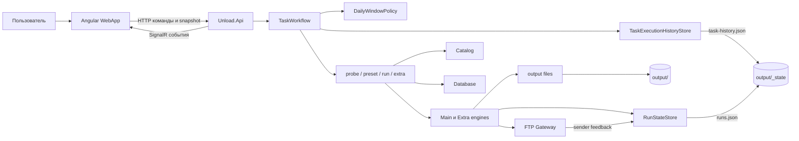
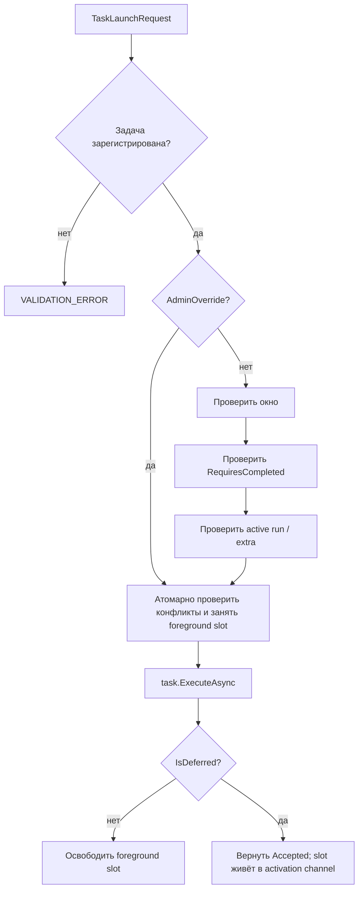
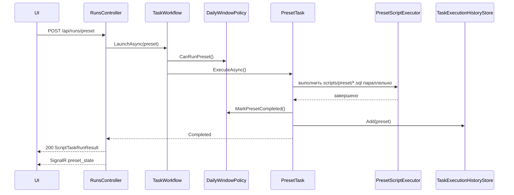
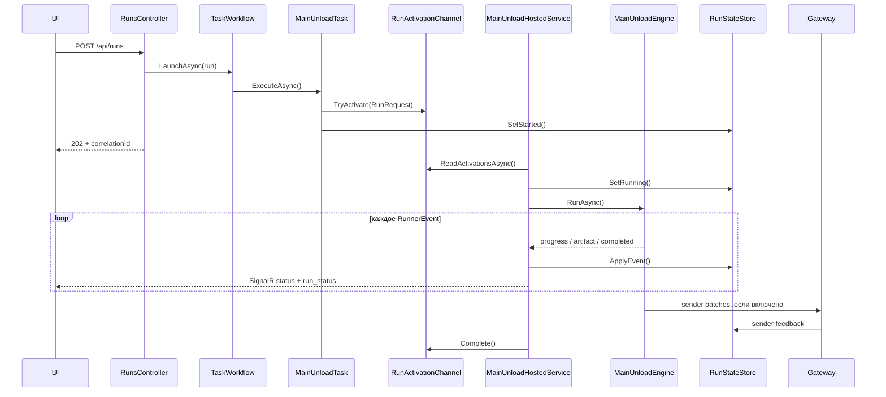
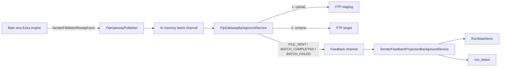

# Архитектура и процессы Unload

Место этого документа в общей структуре описано в [README документации](README.md).
Для первого запуска используйте [START_HERE.md](START_HERE.md), для пользовательских сценариев —
[USER_GUIDE.md](USER_GUIDE.md), для терминов — [GLOSSARY.md](GLOSSARY.md).

Статус: описание фактически реализованного поведения по состоянию на 7 августа 2026 года.

Этот документ предназначен для разработчиков и специалистов сопровождения. Пользовательские действия без внутренних деталей описаны отдельно в [USER_GUIDE.md](USER_GUIDE.md). Здесь объясняется, как запрос проходит через систему, какой сервис за что отвечает, зачем он существует, где хранится состояние и что происходит при ошибке или перезапуске.

## 1. Как читать документ

Если нужно быстро найти место изменения:

| Задача | Сначала смотреть |
|---|---|
| Изменить разрешения и конфликты задач | `UnloadTask` конкретной задачи и `TaskWorkflow` |
| Изменить расписание или правила дневного окна | `ProbeSchedulerHostedService`, `DailyWindowPolicy` |
| Изменить основную выгрузку | `MainUnloadTask`, `MainUnloadHostedService`, `MainUnloadEngine` |
| Изменить `Extra` | `ExtraUnloadTask`, `ExtraUnloadHostedService`, `ExtraUnloadEngine` |
| Изменить статусы и восстановление после рестарта | `RunStateStore`, `TaskExecutionHistoryStore` |
| Изменить FTP-доставку | `FtpGatewayPublisher`, `FtpGatewayBackgroundService` |
| Изменить HTTP-контракт | контроллер в `Unload.Api`, модели API, `ApiClientService` во frontend |
| Изменить то, что показывает Angular | `WorkflowStore` и профильный signal store |

Термины:

- **задача** — `probe`, `preset`, `run` или `extra`, зарегистрированная как `UnloadTask`;
- **запуск** — одно выполнение с уникальным `correlationId`;
- **deferred-задача** — HTTP-запрос только принимает работу, а исполнение продолжается в фоновом сервисе;
- **foreground-задача** — задача завершается внутри вызова `TaskWorkflow.LaunchAsync`;
- **дневное окно** — период от настроенного времени начала до `23:59`, в котором после успешного `preset` разрешены `run` и `extra`;
- **target** — связка группы и мембера, определяющая набор SQL-скриптов основной выгрузки;
- **sender batch** — партия готовых файлов одного логического участника для доставки в шлюз.

## 2. Назначение системы

Unload управляет ежедневным процессом подготовки и выгрузки данных:

```text
probe -> preset -> run
                 -> extra
```

`probe` и `preset` открывают рабочий день. После `preset` основная и дополнительная выгрузки независимы: один `run` и один `extra` могут выполняться одновременно. Два `run` одновременно запрещены, как и два `extra`. Обычный `preset` конфликтует с обоими типами выгрузки.

Система разделяет пять разных обязанностей:

1. Angular отображает состояние и отправляет команды.
2. API принимает команды, валидирует транспортные данные и публикует обновления.
3. `TaskWorkflow` принимает единое решение, можно ли запустить задачу.
4. Движки выполняют SQL, создают файлы и формируют события прогресса.
5. Хранилища и gateway фиксируют состояние и доставку результатов.

## 3. Общая схема


```mermaid
flowchart LR
    User[Пользователь] --> Web[Angular WebApp]
    Web -->|HTTP команды и snapshot| Api[Unload.Api]
    Api -->|SignalR события| Web

    Api --> Workflow[TaskWorkflow]
    Workflow --> Window[DailyWindowPolicy]
    Workflow --> History[TaskExecutionHistoryStore]
    Workflow --> Tasks[probe / preset / run / extra]

    Tasks --> Catalog[Catalog]
    Tasks --> Db[Database]
    Tasks --> Engines[Main и Extra engines]
    Engines --> Files[output files]
    Engines --> State[RunStateStore]
    Engines --> Gateway[FTP Gateway]
    Gateway -->|sender feedback| State

    State -->|runs.json| Disk[(output/_state)]
    History -->|task-history.json| Disk
    Files --> Output[(output/)]
```

Главная архитектурная граница: контроллеры не должны самостоятельно решать, можно ли выполнять бизнес-задачу. Это решение централизовано в `TaskWorkflow`. Движки, в свою очередь, не знают про HTTP и Angular — они работают через доменные запросы, события и инфраструктурные интерфейсы.

## 4. Карта проектов и сервисов

### 4.1. Backend

| Проект / компонент | Что делает | Зачем выделен отдельно |
|---|---|---|
| `Unload.Core` | Содержит общие модели и интерфейсы: `RunRequest`, `RunnerEvent`, `ICatalogService`, `IDatabaseClient`, `IFileChunkWriter`, gateway-контракты | Не даёт инфраструктуре и движкам зависеть друг от друга напрямую |
| `Unload.Catalog` / `JsonCatalogService` | Читает `configs/catalog.json`, связывает группы, мемберов, targets и SQL-файлы, отмечает большие скрипты | Все правила каталога и именования находятся в одном месте |
| `Unload.DataBase` / `DatabaseClientFactory` | Создаёт независимый клиент БД для каждого worker и выполняет SQL | Изолирует конкретное подключение к БД от задач и движков |
| `Unload.FileWriter` / `PipeSeparatedFileChunkWriter` | Записывает чанки, заголовки и строки с разделителем `|`; синхронизирует запись в один файл | Движок отвечает за процесс, writer — только за корректный формат и конкурентную запись |
| `Unload.Cryptography` / `Sha256RequestHasher` | Строит SHA-256 hash запроса | Стабильный технический идентификатор не смешивается с orchestration-кодом |
| `Unload.Store` / `RunStateStore` | Предоставляет публичные доменные операции, выполняет конкурентные обновления через единый CAS-путь и запускает persistence | Это серверный источник истины и небольшой фасад над правилами проекции |
| `Unload.Store` / `RunStateProjector` | Создаёт начальные снимки, применяет runner events к immutable `RunStatusInfo` и координирует специализированные projections | Правила построения состояния не смешиваются с конкурентным хранением |
| `Unload.Store` / `RunMemberProjector`, `RunArtifactProjector`, `RunWorkerProjector` | Обновляют соответственно состояния мемберов, список файлов и занятость workers | Каждое простое правило можно прочитать и проверить без полного жизненного цикла запуска |
| `Unload.Store` / `GatewayFeedbackProjector` | Проецирует `FileSent`, `BatchCompleted` и `BatchFailed` в карту sender batches | Нормализация путей, дедупликация и статусы доставки изолированы от runner events |
| `Unload.Store` / `RunCompletionPolicy` | Чисто вычисляет terminal status после runner completion и gateway feedback | Условия `Completed`/`Failed` и режим без gateway покрываются отдельной таблицей тестов |
| `Unload.Store` / `RunTaskCodeResolver` | Изолирует fallback-определение task code для feedback с неизвестным correlation ID | Зависимость от строковых префиксов находится в одном явно названном и тестируемом месте |
| `Unload.Store` / `TaskExecutionHistoryStore` | Хранит завершённые `probe`, `preset`, `run`, `extra` | Нужен для зависимостей «выполнено сегодня», dashboard и восстановления `preset` после рестарта |
| `Unload.Store` / `JsonFileStore<T>` | Загружает и сохраняет JSON через временный файл и `File.Move` | Одинаковая атомарная персистентность используется обоими хранилищами |
| `Unload.Store` / `RequeueService` | Повторно публикует выбранные существующие файлы в gateway | Повторная доставка не должна повторно выполнять SQL-выгрузку |
| `Unload.Tasks` / `TaskWorkflow` | Проверяет окно, зависимости, конфликты и single-active, читая текущую локальную дату через `TimeProvider`, затем вызывает задачу | Одна точка бизнес-решения предотвращает разные правила в API, Console и scheduler; тесты даты не зависят от системных часов |
| `Unload.Tasks` / `DailyWindowPolicy` | Хранит in-memory состояние текущего дня, читает локальное время через `TimeProvider` и отвечает, можно ли выполнять `preset`, `run`, `extra` | Временные правила не размазаны по UI и задачам, а границы дня воспроизводятся в тестах |
| `Unload.Tasks` / `PresetCompletionRecovery` | Проверяет историю за текущую локальную дату и восстанавливает выполненный `preset` после рестарта | Правило today/yesterday/disabled проверяется отдельно от бесконечного цикла scheduler |
| `Unload.Tasks` / activation channels | Держит один активный `run` и один активный `extra`, передаёт их фоновым workers и маршрутизирует отмену | HTTP не должен оставаться открытым на всё время долгой выгрузки |
| `Unload.Tasks.MainUnload` | Преобразует выбор пользователя в `RunRequest` и выполняет многопоточную основную выгрузку | Сложная логика workers, big/light очередей и чанков изолирована от API |
| `Unload.Tasks.ExtraUnload` | Выбирает обычные или atomic SQL-скрипты, фильтрует банки и создаёт extra-файлы | `Extra` имеет другую единицу выбора и другой формат агрегации, чем main run |
| `Unload.Tasks.Preset` | Выполняет автоматический `probe` и синхронный `preset` | Подготовка рабочего дня отделена от выгрузок |
| `Unload.Gateway` | Формирует sender batches, отправляет файлы на FTP и выпускает feedback | Создание файла и подтверждённая доставка — разные состояния |
| `Unload.Bootstrapper` / `AddUnloadRuntime` | Загружает конфигурацию, вычисляет пути и регистрирует runtime в DI | API и Console получают одинаковый набор сервисов |
| `Unload.Api` | HTTP, SignalR, обработка ошибок, hosted services | Транспорт отделён от бизнес-правил и движков |

Правило терминологии: `execution` означает один запуск задачи любого типа; `main run` — только
задачу с `TaskCode = run`; `extra` — задачу с `TaskCode = extra`. Имена `RunStateStore`,
`RunStatusInfo`, endpoint `/api/runs`, SignalR event `run_status` и файл `runs.json` обозначают
общий исторически сложившийся контракт состояния для `main run` и `extra`, поэтому тип внутри
этого контракта всегда различается по `TaskCode`.

### 4.2. Клиенты и вспомогательные процессы

| Проект | Роль |
|---|---|
| `web/webApp` | Основной Angular-клиент: dashboard, выбор targets/банков, active state, история, скачивание |
| `console/Unload.Console` | Локальный клиент того же runtime без HTTP; полезен для запуска и диагностики |
| `console/Unload.WebConsole` | CLI-клиент к API через HTTP и SignalR |
| `console/Unload.FtpServer` | Локальный FTP-сервер для разработки и end-to-end проверки |
| `console/Unload.GatewayHandler` | Тестовый/вспомогательный потребитель опубликованных gateway-файлов |

## 5. Запуск приложения и composition root

`backend/Unload.Api/Program.cs` выполняет только сборку host:

1. настраивает NLog;
2. регистрирует controllers, Problem Details и SignalR;
3. вызывает `AddUnloadRuntime(configuration)`;
4. добавляет API-specific hosted services;
5. публикует controllers и hub `/hubs/status`.

NLog пишет сообщения API одновременно в консоль и в дневной CSV-файл
`backend/Unload.Api/bin/<Configuration>/net10.0/logs/api-v2-<date>.csv`. Суффикс версии
не позволяет дописать новую схему колонок в прежние `api-<date>.csv`. В CSV сохраняются
отрендеренный текст сообщения, исключение, HTTP `traceId` и структурированные поля
`correlationId`, `taskCode`, `batchId`, когда они переданы через `ILogger`. Для категорий
Unload минимальный уровень — `Information`; для `Microsoft.*` — `Warning`, кроме
информационных сообщений `Microsoft.Hosting.Lifetime` о запуске и остановке процесса.
Фоновые читатели activation, gateway batch и sender feedback считают отмену host штатной
остановкой и не повышают её до `Error`/`Fatal`.

`AddUnloadRuntime` — единая точка композиции runtime. Она:

- находит корень workspace по `configs/catalog.json` и каталогу `scripts/`;
- валидирует секцию `Database`;
- регистрирует catalog, database factory, file writer, hasher и gateway;
- создаёт `RunStateStore` на `output/_state/runs.json`;
- создаёт `TaskExecutionHistoryStore` на `output/_state/task-history.json`;
- регистрирует `TimeProvider.System` как единый источник текущего времени по умолчанию;
- регистрирует задачи, движки, workflow и activation channels.

Почему это важно: если новый сервис зарегистрирован только в API, `Unload.Console` получит другое поведение. Общую runtime-зависимость следует регистрировать через `AddUnloadRuntime`; только HTTP/SignalR-specific компонент — в `Program.cs` API.

## 6. Единая модель запуска задач

### 6.1. Декларация правил

Каждая задача наследует `UnloadTask` и объявляет правила свойствами. `TaskWorkflow` исполняет их одинаково для API, scheduler и Console.

| Задача | Зависит от успешного запуска сегодня | Конфликтует | Требует открытое дневное окно | Модель исполнения |
|---|---|---|---|---|
| `probe` | — | — | нет | синхронная |
| `preset` | `probe` | `run`, `extra` | особое preset-окно | синхронная |
| `run` | `preset` | `preset` | да | deferred, single-active |
| `extra` | `preset` | `preset` | да | deferred, single-active |

`run` и `extra` не конфликтуют друг с другом и используют разные каналы, поэтому могут выполняться параллельно.

### 6.2. Что делает `TaskWorkflow.LaunchAsync`


```mermaid
flowchart TD
    Request[TaskLaunchRequest] --> Resolve{Задача зарегистрирована?}
    Resolve -->|нет| Validation[VALIDATION_ERROR]
    Resolve -->|да| Admin{AdminOverride?}
    Admin -->|нет| Window[Проверить окно]
    Window --> Deps[Проверить RequiresCompleted]
    Deps --> Active[Проверить active run / extra]
    Admin -->|да| Claim
    Active --> Claim[Атомарно проверить конфликты и занять foreground slot]
    Claim --> Execute[task.ExecuteAsync]
    Execute --> Sync{IsDeferred?}
    Sync -->|нет| Release[Освободить foreground slot]
    Sync -->|да| Accepted[Вернуть Accepted; slot живёт в activation channel]
```

Последовательность:

1. Найти задачу по `TaskCode`.
2. Если `AdminOverride == false`, проверить `DailyWindowPolicy`, `RequiresCompleted` за текущую локальную дату из `TimeProvider` и active channel соответствующего типа.
3. Под одним lock проверить конфликты с foreground-задачами и занять slot. Это закрывает гонку двух одновременных запросов.
4. Вызвать `ExecuteAsync`.
5. Для синхронной задачи освободить slot в `finally`. Deferred-задача освобождает свой channel только после завершения hosted service.

`AdminOverride` пропускает бизнес-проверки окна, зависимостей и конфликтов, но не отменяет технические ограничения: второй `run` или `extra` всё равно не поместится в single-active channel, а `PresetTask` дополнительно защищён semaphore.

## 7. Дневное окно: `probe -> preset`

### 7.1. Почему есть два этапа

Время начала означает только момент, когда можно начать проверять готовность данных. Оно не гарантирует, что источник уже готов. Поэтому:

- `ProbeSchedulerHostedService` отвечает за расписание и повторение;
- `ProbeTask` отвечает за один SQL-запрос готовности;
- `DailyWindowPolicy` хранит результат и принимает решение;
- `PresetTask` выполняет подготовительные SQL-скрипты.

### 7.2. Автоматический `probe`

После запуска API scheduler:

1. применяет `PresetGateOptions`;
2. вызывает `PresetCompletionRecovery`: если `preset` уже успешно выполнен сегодня, восстанавливает `PresetCompleted`;
3. до настроенного `StartHour:StartMinute` ничего не запускает;
4. после начала окна по `PollIntervalSeconds` вызывает `TaskWorkflow.LaunchAsync(probe)`;
5. `ProbeTask` выполняет `ProbeSql`, берёт первое значение первой строки и трактует только `1` как готовность;
6. новое состояние публикуется событием SignalR `preset_state`;
7. после `ReadyForPreset == true` повторные probe до конца текущего дня не нужны.

Минимальный фактический интервал scheduler — 5 секунд, даже если в конфигурации указано меньше.

### 7.3. Синхронный `preset`


```mermaid
sequenceDiagram
    participant UI
    participant API as RunsController
    participant WF as TaskWorkflow
    participant Policy as DailyWindowPolicy
    participant Task as PresetTask
    participant DB as PresetScriptExecutor
    participant History as TaskExecutionHistoryStore

    UI->>API: POST /api/runs/preset
    API->>WF: LaunchAsync(preset)
    WF->>Policy: CanRunPreset()
    WF->>Task: ExecuteAsync()
    Task->>DB: выполнить scripts/preset/*.sql параллельно
    DB-->>Task: завершено
    Task->>Policy: MarkPresetCompleted()
    Task->>History: Add(preset)
    Task-->>API: Completed
    API-->>UI: 200 ScriptTaskRunResult
    API-->>UI: SignalR preset_state
```

`preset` синхронный: HTTP 200 означает, что его SQL-скрипты уже завершены и дневное окно открыто. Это принципиально отличается от `run` и `extra`, где HTTP 202 означает только принятие.

`DailyWindowPolicy` живёт в памяти. Успешный `preset` дополнительно записывается в `task-history.json`, поэтому scheduler может восстановить открытое окно после рестарта в тот же день. При смене локальной даты состояние сбрасывается. Текущее локальное время policy получает через стандартный `.NET TimeProvider`: runtime использует `TimeProvider.System`, а тесты подставляют управляемое время без ожидания реальных часов.

## 8. Основная выгрузка `run`

### 8.1. Приём запроса

`POST /api/runs` принимает либо `memberCodes`, либо `targetCodes`:

- для `memberCodes` `MainUnloadTask` загружает каталог и разворачивает мемберов в targets;
- для `targetCodes` используются переданные targets;
- коды нормализуются, дубликаты удаляются, неизвестные мемберы отклоняются;
- `RunRequestFactory` создаёт `correlationId`, hash и запрос движка;
- `RunActivationChannel.TryActivate` резервирует единственный main slot;
- `RunStateStore.SetStarted` создаёт persisted-состояние;
- API возвращает `202 Accepted` с URL статуса, hub и stop endpoint.

### 8.2. Фоновое исполнение


```mermaid
sequenceDiagram
    participant UI
    participant API as RunsController
    participant WF as TaskWorkflow
    participant Task as MainUnloadTask
    participant Channel as RunActivationChannel
    participant Worker as MainUnloadHostedService
    participant Engine as MainUnloadEngine
    participant State as RunStateStore
    participant Gateway

    UI->>API: POST /api/runs
    API->>WF: LaunchAsync(run)
    WF->>Task: ExecuteAsync()
    Task->>Channel: TryActivate(RunRequest)
    Task->>State: SetStarted()
    API-->>UI: 202 + correlationId

    Worker->>Channel: ReadActivationsAsync()
    Worker->>State: SetRunning()
    Worker->>Engine: RunAsync()
    loop каждое RunnerEvent
        Engine-->>Worker: progress / artifact / completed
        Worker->>State: ApplyEvent()
        Worker-->>UI: SignalR status + run_status
    end
    Engine->>Gateway: sender batches, если включено
    Gateway->>State: sender feedback
    Worker->>Channel: Complete()
```

### 8.3. Работа `MainUnloadEngine`

Движок выполняет следующую цепочку:

1. проверяет запрос, `WorkerCount`, размер чанка и доступность БД;
2. через catalog получает `ScriptDefinition` для выбранных targets;
3. создаёт папку `output/<dd_MM_yyyy_HHmmss>/`;
4. делит скрипты на big и light очереди;
5. запускает `WorkerCount` workers: `n - 1` ориентированы на big scripts, один сохраняется для light scripts;
6. каждый worker использует собственный database client;
7. строки читаются потоково, накапливаются до лимита чанка и передаются file writer;
8. создаются `RunnerEvent` для scripts, workers, файлов и общего lifecycle;
9. готовые файлы группируются по мемберу в sender batches;
10. записывается `run-report.csv`.

Почему используются события: движок не должен напрямую менять Angular-модели или вызывать SignalR. `MainUnloadHostedService` принимает события, а `RunStateStore` строит из них единую проекцию состояния.

### 8.4. Когда `run` считается завершённым

- Если `PublishToGateway == false`, выполнение становится `Completed` после финального события движка; sender batches помечаются как пропущенные по запросу.
- Если отправка включена, финал движка ещё не означает успех всего запуска. `MainUnloadHostedService` ждёт, пока `RunStateStore` получит terminal feedback по всем партиям.
- Только успешный terminal run добавляется в `TaskExecutionHistoryStore` как выполненный сегодня.

## 9. Дополнительная выгрузка `extra`

`Extra` — такая же deferred-задача по lifecycle, но использует отдельные scripts, channel, worker и engine.

### 9.1. Выбор режима

| `SelectedBanks` | Поведение |
|---|---|
| `null` | Все банки; SQL из `scripts/extra/*.sql`, кроме служебных файлов с `_` |
| непустой список | Только выбранные банки; SQL из `scripts/extra/atomic/*.sql` с заменой `{banks}` |
| пустой список | Ошибка `EXTRA_NO_BANKS_SELECTED` |

До помещения работы в очередь `ExtraUnloadTask` проверяет существование каталога, наличие SQL и наличие `{banks}` во всех atomic-скриптах. Благодаря этому конфигурационная ошибка возвращается сразу, а не теряется внутри фонового worker.

### 9.2. Исполнение

1. `ExtraUnloadTask` создаёт `ExtraRunRequest` и занимает `ExtraActivationChannel`.
2. `RunStateStore.SetStarted(..., taskCode: "extra")` создаёт состояние.
3. API возвращает `202 Accepted`.
4. `ExtraUnloadHostedService` переводит состояние в `Running` и вызывает `ExtraUnloadEngine`.
5. `ExtraUnloadEngine` параллельно выполняет выбранные scripts.
6. `ExtraScriptExecutor` читает SQL-результат, `ExtraOutputWriter` группирует строки и пишет чанки.
7. События проецируются тем же `RunStateStore`, что и main run, поэтому UI использует общий `RunStatusInfo`.
8. При включённом gateway worker ждёт terminal sender feedback.
9. При успехе создаётся запись `TaskExecutionHistoryStore` с кодом `extra`, затем освобождается extra channel.

Отдельный channel нужен, чтобы `run` и `extra` могли работать параллельно, но каждый тип оставался single-active.

## 10. Gateway и подтверждение доставки


```mermaid
flowchart LR
    Engine[Main или Extra engine] -->|SenderFileBatchReadyEvent| Publisher[FtpGatewayPublisher]
    Publisher --> Queue[In-memory batch channel]
    Queue --> FtpWorker[FtpGatewayBackgroundService]
    FtpWorker -->|1. upload| Staging[FTP staging]
    FtpWorker -->|2. rename| Target[FTP target]
    FtpWorker -->|FILE_SENT / BATCH_COMPLETED / BATCH_FAILED| Feedback[Feedback channel]
    Feedback --> Projection[SenderFeedbackProjectionBackgroundService]
    Projection --> State[RunStateStore]
    Projection --> SignalR[run_status]
```

`FtpGatewayBackgroundService` сначала полностью загружает все файлы партии в staging, затем переименовывает их в target в отсортированном порядке. Потребитель target-каталога не должен увидеть частично записанный файл.

Feedback имеет три ключевых вида:

- `FILE_SENT` — конкретный файл опубликован;
- `BATCH_COMPLETED` — вся партия завершена;
- `BATCH_FAILED` — партия завершилась ошибкой.

`RunCompletionPolicy` сопоставляет финал движка и состояния sender batches. Поэтому серверным источником истины о доставке является feedback, а не сам факт существования output-файла.

`RequeueService` создаёт новые партии из уже существующих файлов. Он не меняет исходные данные и не выполняет SQL повторно.

## 11. Состояние, файлы и восстановление

### 11.1. Что где хранится

| Данные | Место | Назначение |
|---|---|---|
| Полные состояния `run` и `extra` | memory + `output/_state/runs.json` | active view, история, artifacts, gateway delivery |
| Завершённые задачи | memory + `output/_state/task-history.json` | зависимости текущего дня, dashboard, история |
| Результаты main run | `output/<timestamp>/output-files/` | готовые файлы выгрузки |
| Отчёт main run | `output/<timestamp>/run-report.csv` | техническая сводка выполнения |
| Результаты `Extra` | `output/<timestamp>_extra/output-files/` | дополнительные файлы |
| Временные ручные gateway uploads | `output/_uploads/` | staging endpoint `gateway-upload` |

`JsonFileStore<T>` сериализует snapshot во временный `.tmp`, затем заменяет основной файл через `File.Move(..., overwrite: true)`. Ошибка чтения даёт пустое/default состояние и warning; ошибка записи логируется как error. Сейчас сбой персистентности не останавливает выполняющуюся задачу, поэтому логи обязательны для диагностики.

`output/` и `output/_state` могут содержать реальные запуски. Их нельзя очищать целиком во время тестов или обслуживания.

### 11.2. Рестарт API

При создании `RunStateStore` загружается `runs.json`. Записи в `Running` или `CancellationRequested` переводятся в `Cancelled` с сообщением `Run was interrupted due to server restart.`. Продолжения вычислений после рестарта нет: activation channels находятся только в памяти.

`TaskExecutionHistoryStore` загружает завершённые задачи. Если в истории уже есть успешный `preset` за текущую локальную дату, `ProbeSchedulerHostedService` восстанавливает `PresetCompleted`, чтобы повторный preset не требовался.

Следствие: перезапуск восстанавливает историю и корректно закрывает оборванные запуски, но не возобновляет их с середины. Пользователь должен создать новый запуск.

### 11.3. Retention

`HistoryRetentionBackgroundService` выполняется при старте, затем каждые `PruneIntervalMinutes`. Если `RetentionDays > 0`, он удаляет:

- terminal runs старше диапазона хранения;
- старые `TaskRecord`;
- старые staging-каталоги ручных gateway uploads.

Рабочие output-каталоги выгрузок этот сервис не удаляет.

## 12. Отмена и ошибки

`POST /api/runs/{correlationId}/stop` определяет channel по префиксу `extra-`; остальные идентификаторы маршрутизируются в `RunActivationChannel`.

1. Channel отменяет связанный `CancellationTokenSource`.
2. `RunStateStore` фиксирует `CancellationRequested`.
3. SignalR публикует новое состояние.
4. Engine завершает работу на ближайшей безопасной точке.
5. Hosted service фиксирует `Cancelled` и освобождает single-active slot.

Если движок уже закончил работу и worker ждёт gateway delivery, запрос отмены явно переводит запуск в `Cancelled`, иначе ожидание могло бы удерживать slot бесконечно.

Бизнес-ошибки `TaskWorkflow` оформляются как `TaskLaunchException`, преобразуются в `application/problem+json` и содержат стабильный `errorCode`. Непредвиденные ошибки обрабатывает `GlobalExceptionHandler`; background workers ловят исключения сами, переводят состояние в `Failed` и продолжают читать следующие активации.

Основные коды:

| Код | Причина |
|---|---|
| `PRESET_GATE_BLOCKED` | окно или готовность preset не позволяют запуск |
| `TASK_DEPENDENCY_NOT_SATISFIED` | обязательная задача не выполнена сегодня |
| `RUN_ALREADY_IN_PROGRESS` | уже активен main run |
| `TASK_ALREADY_RUNNING` | активна конфликтующая задача или `Extra` |
| `UNKNOWN_MEMBER_CODES` | переданы неизвестные мемберы |
| `EXTRA_NO_BANKS_SELECTED` | явно передан пустой выбор банков |
| `EXTRA_SCRIPTS_NOT_FOUND` | отсутствует каталог или SQL для `Extra` |
| `EXTRA_PLACEHOLDER_MISSING` | atomic SQL не содержит `{banks}` |
| `RUN_NOT_FOUND` | stop запрошен для неактивного запуска |

## 13. Frontend: состояние и синхронизация

### 13.1. Слои Angular

| Компонент | Ответственность |
|---|---|
| `ApiClientService` | Все HTTP-вызовы и построение download URL |
| `RealtimeHubService` | SignalR connection, reconnect и потоки событий |
| `WorkflowStore` | Фасад для компонентов и координация нескольких stores |
| `DashboardStore` | snapshot дня, история и timestamps |
| `RunStore` | активный main run, polling fallback, start/stop/requeue |
| `ExtraStore` | банки, active extra, start/stop и polling fallback |
| `PresetStore` | состояние окна и выполнение preset |
| `CatalogStore` | каталог и доступные мемберы |
| `SelectionStore` | выбранные targets и browser persistence |
| `OutputFilesStore` | листинг файлов для истории |

UI-компоненты должны обращаться к `WorkflowStore`, а не самостоятельно собирать несколько HTTP-ответов. Это удерживает правила восстановления и вычисляемые состояния вне шаблонов.

### 13.2. Bootstrap страницы

При первом открытии `WorkflowStore.bootstrapAsync` параллельно получает:

- каталог;
- мемберов;
- preset state;
- active main run;
- серверное время;
- dashboard snapshot;
- сегодняшние `run` и `extra`.

Затем stores согласуются между собой, загружаются файлы истории, сохранённый выбор targets фильтруется по актуальному каталогу, а найденный active run синхронизируется по `correlationId`.

### 13.3. SignalR и fallback

`RealtimeHubService` слушает `status`, `run_status`, `preset_state`, автоматически переподключается и вручную перезапускает полностью закрытое соединение.

Если SignalR недоступен во время активной задачи, `RunStore` и `ExtraStore` включают HTTP polling статуса. После reconnect stores обновляют snapshot, чтобы добрать пропущенные события. Таким образом SignalR ускоряет отображение, но не является единственным способом восстановить состояние.

Browser storage хранит только локальные UI-настройки, например выбор targets и часть preset-view state. Он не является источником истины о серверном lifecycle.

## 14. HTTP и SignalR contracts

### 14.1. Основные endpoints

| Метод | Путь | Результат |
|---|---|---|
| `POST` | `/api/runs` | Принять main run; `202 RunAcceptedResponse` |
| `POST` | `/api/runs/extra` | Принять `Extra`; `202 RunAcceptedResponse` |
| `POST` | `/api/runs/preset` | Выполнить preset; `200 ScriptTaskRunResult` |
| `GET` | `/api/runs/preset/state` | Текущее `PresetGateState` |
| `GET` | `/api/runs/{correlationId}` | Полный `RunStatusInfo` main или extra |
| `GET` | `/api/runs/active` | Только active main run; active extra восстанавливается из `/today` |
| `GET` | `/api/runs/today` | Сегодняшние main и extra runs |
| `GET` | `/api/runs/dashboard` | Состояние окна, флаги и история текущего дня |
| `GET` | `/api/runs/history?days=N` | Runs и task history за 1–365 дней |
| `POST` | `/api/runs/{correlationId}/stop` | Запрос отмены main или extra; `202` |
| `POST` | `/api/runs/requeue` | Повторная отправка выбранных файлов |
| `GET` | `/api/catalog` | Полный каталог |
| `GET` | `/api/members` | Мемберы, targets и active status |
| `GET` | `/api/runs/extra/banks` | Справочник банков для `Extra` |
| `GET` | `/api/system/time` | Локальное и UTC-время сервера |
| `GET` | `/api/system/output-files?path=` | Безопасный рекурсивный листинг output |
| `GET` | `/api/system/download?path=` | Скачать один output-файл |
| `GET` | `/api/system/download-archive?path=` | Создать и скачать ZIP output-папки |
| `POST` | `/api/system/gateway-upload` | Ручная загрузка файлов в gateway |
| `POST` | `/api/system/sender-feedback` | Интеграционный вход sender feedback |

`OutputFilesService` нормализует путь и запрещает выход за пределы output root. В API возвращаются относительные пути, чтобы не раскрывать структуру файловой системы сервера.

### 14.2. SignalR

Hub: `/hubs/status`.

| Событие | Payload | Назначение |
|---|---|---|
| `status` | `RunnerEvent` | Детальный шаг движка |
| `run_status` | `RunStatusInfo` | Агрегированное persisted-состояние main/extra |
| `preset_state` | `PresetGateState` | Состояние дневного окна |
| `preset_replayed` | `ScriptTaskRunResult` | Результат повторного preset в admin mode |

`SubscribeRun(correlationId)` сохранён в hub-контракте, но текущие status events рассылаются всем клиентам. Клиент обязан фильтровать данные по `correlationId` там, где это необходимо.

## 15. Конфигурация

| Секция | Ключи | Влияние |
|---|---|---|
| `Database` | `TimeoutSeconds`, `ConnectionString` | Подключение и timeout SQL; connection string может иметь формат `dpapi:<base64>` |
| `Runner` | `WorkerCount`, размер чанка в runtime options | Параллелизм и разбиение main output |
| `PresetGate` | `Enabled`, `StartHour`, `StartMinute`, `PollIntervalSeconds`, `ProbeSql` | Дневное окно и probe scheduler |
| `Gateway.Ftp` | host, port, credentials, remote/staging directories, timeout | FTP-доставка |
| `HistoryRetention` | `RetentionDays`, `PruneIntervalMinutes` | Срок persisted history и upload staging |
| `Extra` | `ChunkSizeBytes`, имена каталогов/scripts | Разбиение и расположение extra SQL |

Секреты нельзя переносить из environment-specific appsettings в этот документ или примеры команд.

## 16. Каталог, scripts и форматы main output

`configs/catalog.json` задаёт groups, members, targets и опциональные `bigScripts`. Target-код строится из группы и мембера; `JsonCatalogService` сопоставляет его с SQL в `scripts/<group-folder>`.

Формат main SQL:

```text
Y<memberCode><groupCode>_<type>_<codes>_<extension>.sql
```

Формат output-файла:

```text
{first3charsOfScript}{dayOfYear:D3}{chunkNumberBase36}.{extension}
```

Первая строка:

```text
#|{type}|{outputFileName}|2XMDR|{yyyy-MM-dd}|{rowsCountWithoutHeader}|{firstDigitFromCodes}
```

Остальные строки содержат поля через `|` без дополнительного экранирования. Номер чанка сквозной для мембера в рамках запуска; при совпадении имени добавляется суффикс.

## 17. Как безопасно менять архитектуру

### 17.1. Новая задача

1. Добавить код в `TaskCodes`.
2. Создать наследника `UnloadTask` и явно объявить зависимости, конфликты и модель исполнения.
3. Зарегистрировать задачу через project-specific DI extension, вызываемый из `AddUnloadRuntime`.
4. Для deferred-задачи добавить отдельный activation mechanism или обоснованно переиспользовать существующий, затем hosted service.
5. Создать server-side источник истины для статуса до возврата HTTP 202.
6. Добавить API/Console entry point.
7. Добавить error codes, tests и обновить документацию/contracts.

### 17.2. Новый статус или SignalR event

- Сначала определить persisted source of truth.
- Не хранить единственную копию состояния только во frontend.
- Соблюдать terminal lifecycle: `Completed`, `Failed`, `Cancelled` не должны возвращаться в active.
- Обновить backend DTO, frontend models, stores, API docs и Postman collection одновременно.

### 17.3. Новое поле конфигурации

- Привязать и валидировать его в Bootstrapper.
- Указать default и поведение при неверном значении.
- Не читать один и тот же ключ в нескольких проектах независимо.

## 18. Правило актуальности документации

Любое изменение поведения, архитектуры, API, конфигурации, фоновых процессов, persistence, gateway или UI workflow должно включать проверку документации в той же задаче.

Минимальный порядок:

1. Через Graphify найти связи изменяемого класса.
2. Проверить реализацию, DI-регистрацию, contracts и configuration; существующий текст не считать доказательством.
3. Обновить этот документ, если изменилось внутреннее устройство или ответственность.
4. Обновить `USER_GUIDE.md` только если изменилось наблюдаемое пользователем поведение. Архитектурные детали в user guide не переносить.
5. При изменении HTTP обновить Postman collection и frontend contract.
6. Проверить Mermaid, пути, endpoint/event names и утверждения о concurrency/recovery.
7. После source changes обновить Graphify и выполнить project build/test skills.

При обнаружении расхождения код является источником фактического текущего поведения, а документ должен быть исправлен. Планируемое поведение необходимо явно помечать как план, а не описывать в настоящем времени.

## 19. Известные границы текущей реализации

- `DailyWindowPolicy` использует локальное время `TimeProvider.System` и in-memory state; корректность runtime по-прежнему зависит от timezone сервера.
- Activation channels не persisted, поэтому активная работа после рестарта отменяется, а не продолжается.
- Ошибка записи JSON логируется, но не прерывает run; состояние на диске может отстать от памяти.
- SignalR events транслируются всем клиентам; авторизация и изоляция клиентов в текущем контракте не описаны.
- `RunStateStore` всё ещё совмещает CAS-обновления, persistence и recovery; создание снимков и все правила projection уже вынесены и защищены characterization-тестами.

Эти пункты описывают текущие технические свойства, а не обещание будущего рефакторинга.
